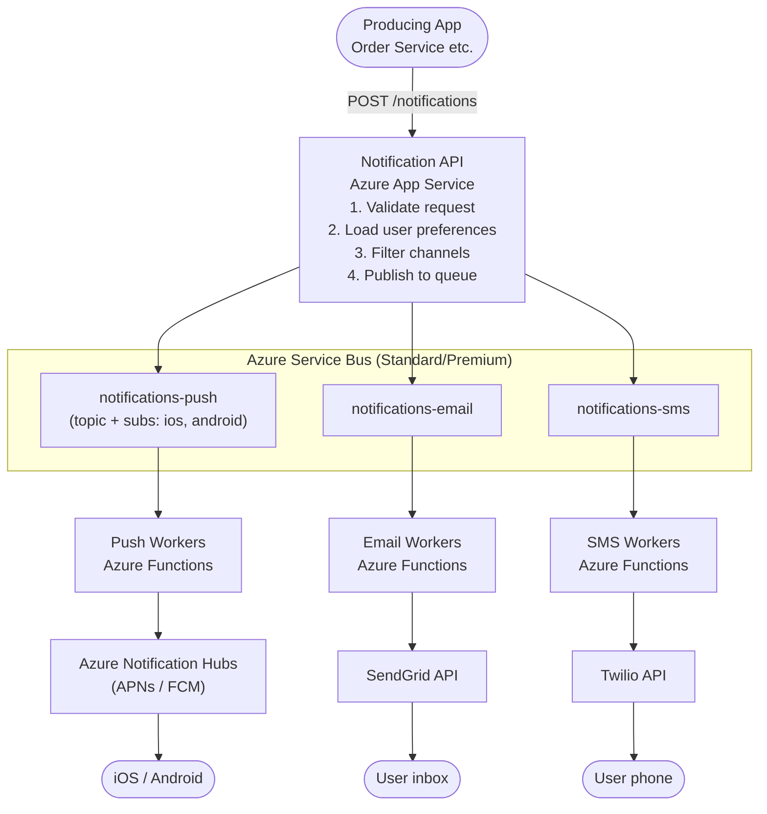
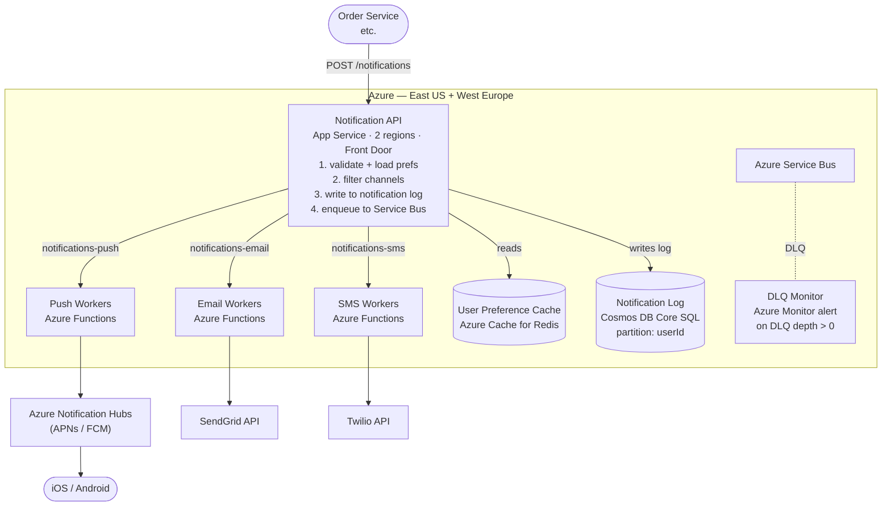

*[Grokking System Design](../../../README.md) · Module 5 — Designing Real Systems · Day 17*

# Day 17 — Notification System

> **Today's one idea:** Fan-out at scale requires a tiered queue architecture — one channel-specific queue per delivery provider, not a single queue for everything — so that a slow SMS gateway cannot block a push notification that should arrive in milliseconds.
> **Reading time:** ~42 min · **Prereqs:** Days 1–16 (entire course) · **This is a synthesis day — no new concepts, only new application**
> **Primary source for today:** Xu, *System Design Interview*, Vol. 1 (Byte Code LLC, 2020) — Chapter 10, "Design a Notification System"

---

## Step 1 — Requirements

### Functional requirements
1. Send notifications to users via three channels: **push notification** (iOS/Android), **email**, and **SMS**.
2. Notifications are triggered by application events: new message, order shipped, promotional campaign.
3. Users can configure per-channel preferences (opt out of SMS, mute email for certain event types).
4. Support both **transactional notifications** (order shipped — high priority, must deliver) and **marketing notifications** (promotional — lower priority, bulk delivery acceptable).
5. Notifications can be scheduled for future delivery.
6. Producers call a single API regardless of channel — routing is the notification system's concern.

### Non-functional requirements (priority order)
1. **Availability:** 99.9%. Notification delivery must not block the producing application.
2. **Scalability:** 10M notifications/day today; 100M/day at peak (campaign blast).
3. **Latency:** Transactional notifications delivered within 30 seconds. Marketing: best-effort within 10 minutes.
4. **Durability:** No notification must be silently lost. Failed deliveries must be retried and auditable.
5. **Extensibility:** Adding a fourth channel (WhatsApp, Slack) must not require redesigning the core system.

### Out of scope
- Building push notification infrastructure (we use APNs, FCM, Azure Notification Hubs).
- Building email/SMS sending infrastructure (we use SendGrid, Twilio).
- Real-time in-app notifications (WebSocket / SignalR — a separate system).

---

## Step 2 — Capacity Estimation

```
Peak load (campaign blast):
  100M notifications/day ÷ 86,400 ≈ 1,160 notifications/second (sustained)
  Campaign blast: 10M notifications in 30 minutes = ~5,500/second peak

Channel split (typical):
  60% push   = 3,300/second push
  30% email  = 1,650/second email
  10% SMS    =   550/second SMS

Notification record storage:
  Per notification: ~500 bytes (event type, userId, channel, status, payload, timestamps)
  100M/day × 500 bytes × 90 days retention = ~4.5 TB

User preference storage:
  500M users × 200 bytes (preference flags per channel) = 100 GB
  → Fits comfortably in Cosmos DB with userId as partition key
```

---

## Step 3 — Options Considered

### Decision A: How does the producing application send a notification?

**Option 1 — Synchronous HTTP to a Notification Service**
Producer calls `POST /notifications` and waits for a 200 OK. Notification Service synchronously calls APNs/FCM/SendGrid.

| | Score (1–5) |
|-|------------|
| Availability | 2 — if APNs is slow, producer blocks |
| Latency | 3 — delivery happens immediately if providers are fast |
| Scalability | 2 — tight coupling; provider outage cascades to producers |

**Option 2 — Producer publishes an event to a message queue; Notification Service consumes asynchronously**
Producer publishes `NotificationRequested` to Service Bus. Returns immediately. Notification workers consume independently.

| | Score (1–5) |
|-|------------|
| Availability | 5 — producer never blocked by provider latency |
| Latency | 4 — adds ~100ms queue overhead; transactional SLA is 30s (ample) |
| Scalability | 5 — workers scale independently; queue absorbs campaign bursts |

**Decision: Option 2.** The async queue is the correct architecture for any fan-out workload. The 30-second delivery SLA makes the queue overhead irrelevant. [(Recall Day 10 — async messaging decouples failure domains.)](../../03-compute-communication-building-blocks/days/day-10-async-messaging.md)

---

### Decision B: One queue or per-channel queues?

**Option 1 — Single queue, all channels**
All notifications go to one queue. Worker reads a message and routes to the correct provider.

Risk: SMS gateway slow (300ms/message) → SMS workers consuming from the single queue block push notification workers from running. A campaign of 10M SMS messages delays 6M pending push notifications.

**Option 2 — Per-channel queues**
Three queues: `notifications-push`, `notifications-email`, `notifications-sms`. Workers per channel scale independently.

| | Score (1–5) |
|-|------------|
| Channel isolation | 5 — SMS slowness cannot affect push |
| Operational complexity | 3 — more queues to monitor |
| Extensibility | 5 — add `notifications-whatsapp` with zero changes to existing workers |

**Decision: Option 2 — per-channel queues.** Channel isolation is the primary driver. A slow provider's throughput must not degrade other channels.

---

### Decision C: How do we handle provider failures and retries?

**Option 1 — Retry in-worker with exponential backoff**
Worker catches a failed send, sleeps, retries 3×, then drops the message.

Risk: if APNs is down for 10 minutes, workers retry and eventually move on. Lost notifications. No audit trail.

**Option 2 — Retry via message broker re-delivery + Dead-Letter Queue**
Worker NACKs the message on failure. Service Bus re-delivers with configurable delay. After 5 delivery attempts, moves to DLQ. An alert fires on DLQ depth > 0 for transactional notifications. An operator reprocesses the DLQ when the provider recovers.

| | Score (1–5) |
|-|------------|
| Durability | 5 — no notification is silently dropped |
| Observability | 5 — DLQ is the audit trail; alerts are immediate |
| Complexity | 4 — DLQ monitoring required |

**Decision: Option 2 — Service Bus retry + DLQ.** Durability is NFR #4. Silent loss is unacceptable. [(Recall Day 10 — DLQ is the non-negotiable audit trail for at-least-once delivery.)](../../03-compute-communication-building-blocks/days/day-10-async-messaging.md)

---

## Step 4 — Component Design

### The full request flow



### User preference store

User preferences (channel opt-outs, quiet hours, frequency caps) are stored in **Cosmos DB** (Core SQL, partition key = `userId`). Hot path: read on every notification request.

Preferences are cached in **Redis** with a 5-minute TTL:
```csharp
var prefs = await _cache.GetOrCreateAsync($"prefs:{userId}", async entry =>
{
    entry.AbsoluteExpirationRelativeToNow = TimeSpan.FromMinutes(5);
    return await _cosmosClient.GetUserPreferencesAsync(userId);
});
```

### Notification log (audit trail)

Every notification is written to a **notifications log** in Cosmos DB before the message is queued:

```json
{
  "id": "notif-uuid",
  "userId": "user-42",
  "eventType": "order.shipped",
  "channel": "push",
  "status": "queued",    // → "delivered" | "failed" | "opted_out"
  "payload": { "orderId": "ord-99812", "trackingUrl": "..." },
  "createdAt": "2026-05-13T09:00:00Z",
  "deliveredAt": null,
  "attempts": 0
}
```

Workers update `status` and `deliveredAt` after each delivery attempt. This gives:
- Full delivery audit trail.
- "Did my notification send?" self-serve for customer support.
- Analytics pipeline (delivered rate per channel, per event type).

### Priority and rate limiting

**Transactional vs marketing** is enforced at the queue level using Service Bus **message sessions** or separate queues with different worker scaling rules:

- Transactional queue: dedicated workers, scale-out immediately, max concurrency 50.
- Marketing queue: shared workers, scale-out only if queue depth > 1,000, max concurrency 10.

This ensures a campaign blast doesn't steal workers from order-shipped notifications.

**Per-user rate limiting:** a user shouldn't receive 40 notifications in 10 minutes from a misbehaving producer. Azure Cache for Redis implements a sliding-window counter per user:

```csharp
// Notification API — before queuing
var key = $"notif-rate:{userId}";
var count = await _redis.IncrementAsync(key);
if (count == 1) await _redis.ExpireAsync(key, TimeSpan.FromMinutes(10));
if (count > 20)
{
    _logger.LogWarning("Rate limit exceeded for user {UserId}", userId);
    return Results.StatusCode(429);
}
```

---

## Step 5 — C4 Container Diagram



---

## Step 6 — What We'd Do Differently at 10× Scale

At 1 billion notifications/day:

1. **Service Bus → Event Hubs for fan-out ingestion.** At ~11,500 notifications/second sustained, Service Bus Premium handles it — but Event Hubs gives better throughput at lower cost for pure ingest. The Notification API publishes to Event Hubs; a router function partitions events into per-channel Service Bus queues.

2. **Push workers → Azure Notification Hubs at scale.** Azure Notification Hubs handles device token management and batching to APNs/FCM. At 100M push devices, managing device tokens yourself is untenable. Notification Hubs handles deregistration, batching, and retry internally.

3. **Separate database per concern.** The notification log at 1B/day is 50 GB/day — 18 TB/year. Move it to **Azure Data Explorer** (Kusto) which is designed for time-series append-only data with cheap retention and fast analytical queries.

4. **Campaign scheduling service.** Marketing notifications are scheduled (send at 9 AM user-local-time). A scheduling service with a time-partitioned Cosmos DB collection pre-materialises the send queue 15 minutes before scheduled delivery.

---

## Try It Yourself

**Design challenge:** A user complains: "I received the same order-shipped notification three times on my phone." Walk through the system and identify every place where a duplicate push notification could be generated. How would you add deduplication?

<details>
<summary>Worked answer</summary>

**Places where duplicates can originate:**
1. **Producer retry:** Order Service called `POST /notifications` twice (network timeout on the first call — the response was lost but the request succeeded).
2. **Service Bus re-delivery:** Push Worker processed the notification, called Azure Notification Hubs, received a timeout, NACKed the message — Service Bus redelivered. Notification Hubs had already sent the push.
3. **APNs re-delivery:** Notification Hubs retried the APNs call; APNs had already accepted and delivered it.

**Deduplication strategy:**
1. **At ingest:** Notification API generates a deterministic `notificationId = hash(userId + eventType + eventId)`. Cosmos DB unique key constraint on `notificationId` rejects duplicates at the source.
2. **At queue:** Include `notificationId` as the Service Bus `MessageId`. Service Bus deduplicates messages with the same `MessageId` within a 10-minute window (built-in feature of Service Bus Standard/Premium).
3. **At worker:** Before calling Notification Hubs, check the notification log: if `status == "delivered"`, ACK and skip.

This three-layer deduplication makes the system idempotent end-to-end. [(Recall Day 10 — idempotent consumer pattern.)](../../03-compute-communication-building-blocks/days/day-10-async-messaging.md)

</details>

---

## Suggested Readings for Today

**Required if you have 15 extra minutes:**
Xu, *System Design Interview* Vol. 1 — Chapter 10, "Design a Notification System" (pp. 113–130). Compare Xu's design to the one above — he uses a simpler architecture without per-channel queues. The comparison is instructive: his design is correct for moderate scale; the tiered queue architecture above handles campaign blasts without channel interference.

**If you want the deep version:**
Azure Notification Hubs documentation — "Routing and tag expressions": [https://learn.microsoft.com/en-us/azure/notification-hubs/notification-hubs-tags-segment-push-message](https://learn.microsoft.com/en-us/azure/notification-hubs/notification-hubs-tags-segment-push-message). The tag-based routing in Notification Hubs is what makes targeted campaigns (send to all users in segment "premium-subscribers") efficient. Read this before implementing campaign delivery at scale.

---

← [Day 16 — Resilience at Scale](../../04-distributed-systems-reality/days/day-16-resilience-at-scale.md) &nbsp;|&nbsp; [Day 18 — Social Media Feed →](day-18-social-media-feed.md)
