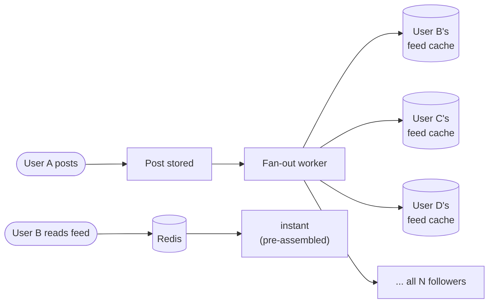
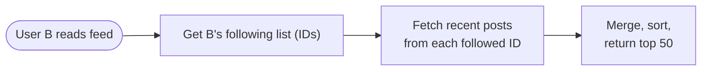
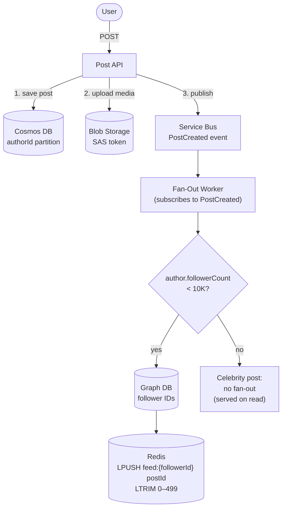
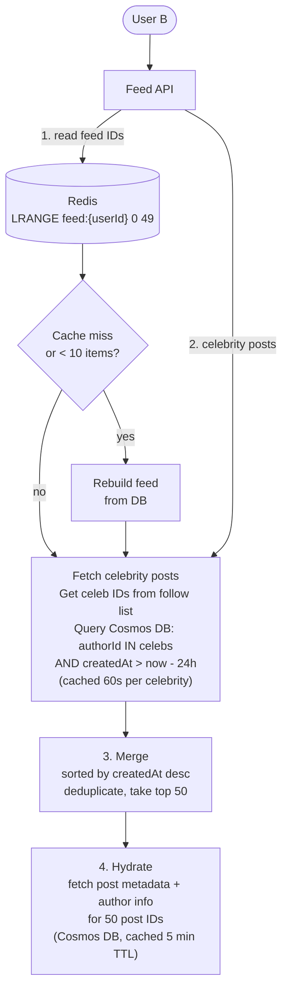

*[Grokking System Design](../../../README.md) · Module 5 — Designing Real Systems · Day 18*

# Day 18 — Social Media Feed

> **Today's one idea:** Fan-out on write pre-computes every follower's feed at post creation time, making reads instant; fan-out on read assembles the feed at request time, making writes instant — the correct choice depends entirely on the ratio of celebrity users to regular users in your system.
> **Reading time:** ~44 min · **Prereqs:** Days 1–16 · **This is a synthesis day**
> **Primary source for today:** Xu, *System Design Interview*, Vol. 1 (Byte Code LLC, 2020) — Chapter 11, "Design a News Feed System"

---

## Step 1 — Requirements

### Functional requirements
1. Users can **post** content (text, images, video).
2. Users can **follow** other users.
3. A user's **feed** shows posts from the people they follow, in reverse-chronological order.
4. Feed must load within 200ms globally.
5. Support **likes** and **comments** on posts.
6. Posts with images/video use the existing Blob Storage and CDN infrastructure [(Day 7)](../../02-storage-building-blocks/days/day-07-blob-cdn-search.md).

### Non-functional requirements (priority order)
1. **Latency:** Feed read p99 < 200ms globally.
2. **Availability:** 99.9%. Feed reads must work even if post creation is temporarily unavailable.
3. **Scalability:** 500M users; 50M DAU; 5M posts/day; 300M feed reads/day.
4. **Eventual consistency acceptable:** A follower may see a new post up to 10 seconds after it's created.

### Key constraints
- **Celebrity problem:** Some users have 50M followers. Posting to a celebrity account with 50M followers can't block the post-creation API for 5 minutes while fan-out completes.
- **Read-to-write ratio:** 300M reads / 5M posts = 60:1. Highly read-dominant. Optimise reads.

---

## Step 2 — Capacity Estimation

```
Posts per second:
  5M posts/day ÷ 86,400 ≈ 58 posts/second (peak ~5× = 290/second)

Feed reads per second:
  300M reads/day ÷ 86,400 ≈ 3,470 reads/second (peak ~3× = ~10,000/second)

Read:Write ratio = 60:1 → heavily read-dominant

Fan-out writes (fan-out on write):
  Average follower count: 200
  58 posts/second × 200 followers = 11,600 feed writes/second (normal users)
  Celebrity post: 1 post × 50M followers = 50M writes → must be async

Feed cache storage:
  50M DAU × 100 posts per cached feed × 100 bytes/post reference = 500 GB
  → Fits in Azure Cache for Redis Premium (1 TB+ tier)

Post metadata storage:
  5M posts/day × 365 days × 5 years × 1 KB/post = ~9 TB
  → Cosmos DB (Core SQL, partition key = authorId)
```

---

## Step 3 — The Core Decision: Fan-Out on Write vs Fan-Out on Read

This is the central architectural decision in any feed system. Every other choice flows from it.

### Option A — Fan-Out on Write (Push model)

When User A posts, the system immediately writes a reference to that post into the cached feed of every one of A's followers.



**Pros:**
- Feed reads are O(1) — just a Redis list read.
- Feed latency is decoupled from follower count at read time.

**Cons:**
- Post creation triggers N writes. For a celebrity with 50M followers: 50M Redis writes = unacceptable write amplification.
- Updating a post (edit, delete) requires updating N cached feeds.
- Users who rarely open the app have feeds maintained in cache unnecessarily.

**Scoring (for a system with mostly regular users):**

| QA | Score |
|----|-------|
| Read latency | 5 |
| Write scalability | 2 (celebrity problem) |
| Storage efficiency | 3 |

### Option B — Fan-Out on Read (Pull model)

When User B opens their feed, the system queries the follow graph, fetches recent posts from each followed account, merges and sorts them.



**Pros:**
- Post creation is a single write — no fan-out.
- No celebrity problem — a celebrity post is one write regardless of follower count.

**Cons:**
- Feed reads are O(following_count) — fetching from 500 followed accounts = 500 parallel queries.
- Even with parallel fetching, merging 500 result sets adds latency.
- p99 feed read latency degrades for power users who follow 1,000 accounts.

**Scoring:**

| QA | Score |
|----|-------|
| Read latency | 2 (for active users) |
| Write scalability | 5 |
| Storage efficiency | 5 |

### Decision: Hybrid — Fan-Out on Write for regular users, Fan-Out on Read for celebrities

Neither pure approach works. The industry solution (Twitter/X, Instagram, Weibo all use this):

- **Regular users (< 10K followers):** Fan-out on write. Post creation asynchronously writes to all followers' feed caches.
- **Celebrity users (≥ 10K followers):** Fan-out on read. Their post is stored once. When a user's feed is loaded, celebrity posts are fetched on the fly and merged with the pre-assembled feed from regular users.

```
Feed read for User B:
  1. Read pre-assembled feed from Redis (populated by fan-out on write from regular users)
  2. Fetch recent posts from celebrities User B follows (on-demand query from Cosmos DB)
  3. Merge and rank (reverse-chronological or ranked feed)
  4. Return top 50 posts, cache merged result with 60s TTL
```

This hybrid limits the fan-out write load (no celebrity writes) while keeping feed reads fast (most of the feed is pre-assembled; celebrity lookups are bounded and cacheable).

---

## Step 4 — Component Design

### Post creation flow



### Feed read flow



### The Follow Graph

Follower/following relationships are a graph traversal problem. Options:

| Store | Why |
|-------|-----|
| Cosmos DB (Core SQL) | `{followerId, followingId, createdAt}` — simple, scales well for point-lookups and "who does User B follow?" |
| Azure Cosmos DB Gremlin | Rich graph traversal ("friends of friends") — overkill for simple follower lists |

**Decision: Cosmos DB Core SQL** with two collections: `follows` (partition: `followerId`) for "who do I follow?" and `followers` (partition: `followingId`) for "who follows me?" This denormalization [(Day 5)](../../02-storage-building-blocks/days/day-05-nosql.md) makes both queries O(1) per partition.

### Feed cache structure (Redis)

```
Key:   feed:{userId}
Type:  List (sorted by insertion — most recent first)
Value: [postId1, postId2, ..., postId499]  (post IDs only — not full post content)

Key:   post:{postId}
Type:  Hash
Value: { authorId, content, mediaUrl, likeCount, commentCount, createdAt }
TTL:   5 minutes

Key:   celeb-posts:{celebId}
Type:  Sorted Set, score = createdAt unix timestamp
Value: [postId1, postId2, ...]
TTL:   60 seconds
```

Storing post IDs (not full content) in the feed list keeps the feed cache lean and keeps post content in one canonical location. Feed reads require a second Redis lookup per post ID — but with pipelining, 50 parallel `HGETALL post:{postId}` calls complete in ~1ms.

---

## Step 5 — C4 Container Diagram

```mermaid
flowchart TD
    Client(["Mobile / Web"])

    subgraph Azure["Azure — multi-region"]
        FD["Azure Front Door\nGlobal routing + CDN for media"]
        PostAPI["Post API\nApp Service"]
        FeedAPI["Feed API\nApp Service"]
        Cosmos[("Cosmos DB\nPosts (authorId)\nFollows (followerId)\nFollowers (followingId)")]
        Redis[("Azure Cache for Redis\nfeed:{userId} lists\npost:{postId} hashes\nceleb-posts:{celebId} sorted sets")]
        SB["Azure Service Bus\nTopic: post-created"]
        FW["Fan-Out Worker\nAzure Functions\nFan-out on write for regular users"]
        Blob[("Azure Blob Storage + CDN\nPost media — images, video")]
    end

    Client -->|HTTPS| FD
    FD --> PostAPI
    FD --> FeedAPI
    PostAPI -->|reads/writes| Cosmos
    PostAPI -->|upload media| Blob
    PostAPI -->|publishes PostCreated| SB
    FeedAPI -->|feed IDs + post hashes| Redis
    FeedAPI -->|celebrity posts + hydrate| Cosmos
    SB --> FW
    FW -->|LPUSH feed:{followerId}| Redis
```

---

## Step 6 — What We'd Do Differently at 10× Scale

At 5 billion users / 500M DAU:

1. **Ranked feed, not chronological.** ML ranking (engagement probability per post per user) replaces simple reverse-chronological. The feed becomes a recommendation problem. Redis stores post IDs; a ranking service re-orders them before returning to the client.

2. **Graph store for social graph.** At 5B users, "who follows whom?" is a graph traversal problem that benefits from a dedicated graph database (Neptune, JanusGraph) rather than two Cosmos DB collections.

3. **Event Hubs for fan-out ingestion.** 2,900 posts/second requires Event Hubs partitioned by author ID. Fan-out workers are Event Hubs consumers grouped by partition — each worker handles a shard of authors.

4. **Regional Redis clusters.** Feed cache is user-affinity routed: User B's feed is cached in the Azure region closest to them. Azure Front Door's geolocation routing ensures reads always hit the local cache.

---

## Try It Yourself

**Design challenge:** Twitter introduced an "edit post" feature. A post that has already been fan-out-written to 1 million followers' cached feeds is now edited. How do you propagate the edit?

<details>
<summary>Worked answer</summary>

**Option 1 — Update in place (update Redis hashes):**
The post content is stored as a Redis hash (`post:{postId}`). Updating the hash updates the cached content for all users simultaneously — feed list entries (post IDs) don't change. This is O(1) per edit regardless of follower count. **This is the correct answer** — because we store post IDs in the feed list, not post content, the edit propagates immediately when post metadata is refreshed.

**The catch:** Redis TTL. The post hash has a 5-minute TTL. If User C loaded their feed 4 minutes ago, their client has the old version cached. The edit won't be visible until the TTL expires and the hash is refreshed on the next feed load. **Solution:** when a post is edited, explicitly call `DEL post:{postId}` in Redis (invalidate the cache immediately). The next read for that post will fetch the updated content from Cosmos DB and repopulate the cache.

**What about the fan-out on write feed lists?** The lists contain post IDs — they don't need updating. Only the post content hash needs invalidation. This is the architectural payoff of separating "which posts are in the feed" (the ID list) from "what does this post contain" (the hash).

**Audit trail:** Create an `edit_history` sub-collection in Cosmos DB to record the original and edited content, with timestamps. Required for platform trust and policy enforcement.

</details>

---

## Suggested Readings for Today

**Required if you have 15 extra minutes:**
Xu, *System Design Interview* Vol. 1 — Chapter 11, "Design a News Feed System" (pp. 131–148). Xu covers the same hybrid fan-out approach. Pay particular attention to his data model decisions for the post table vs the news feed table — compare his relational-style approach against the Cosmos DB + Redis approach above.

**If you want the deep version:**
Kleppmann, *DDIA* — Chapter 12, "The Future of Data Systems," section "Combining Specialised Storage" (pp. 499–502). Kleppmann argues that complex applications like news feeds require combining multiple storage technologies (graph store + cache + blob storage) rather than forcing everything into one database. The feed design above is a concrete instantiation of this argument.

---

← [Day 17 — Notification System](day-17-notification-system.md) &nbsp;|&nbsp; [Day 19 — Search Autocomplete →](day-19-search-autocomplete.md)
