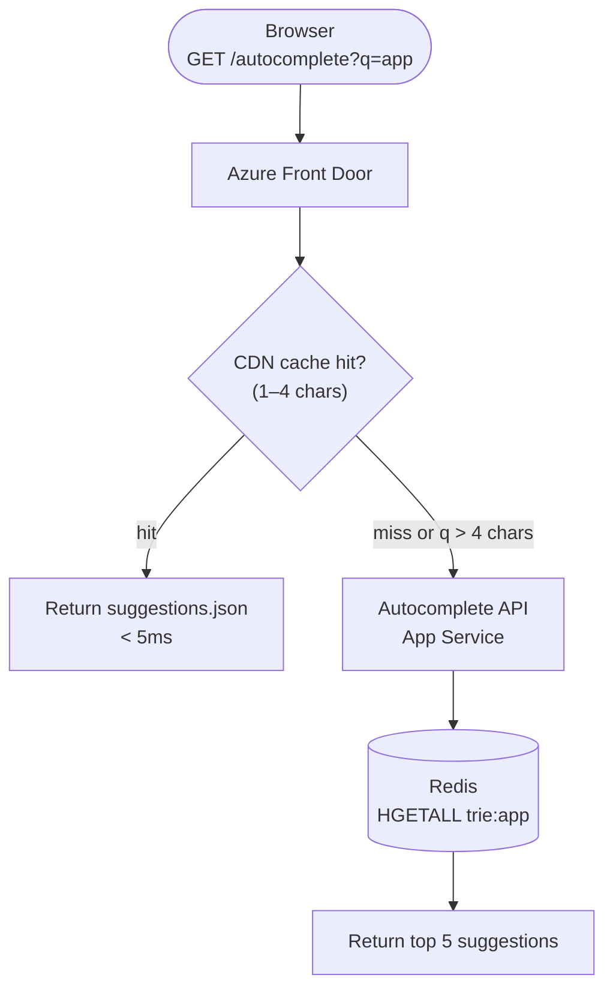
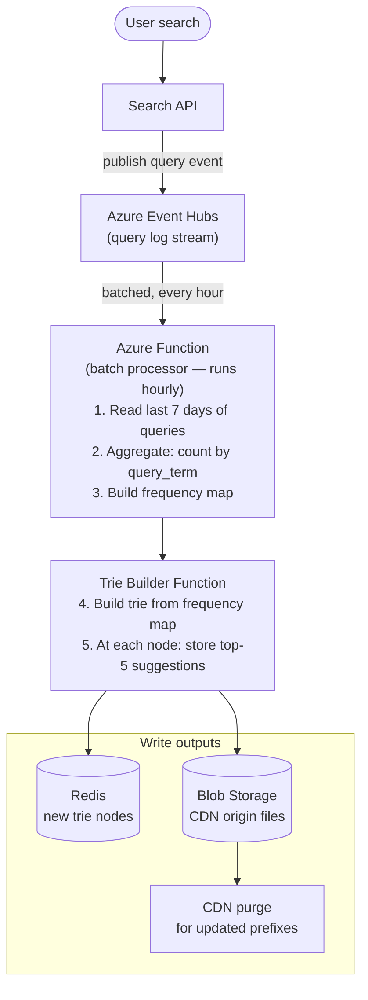
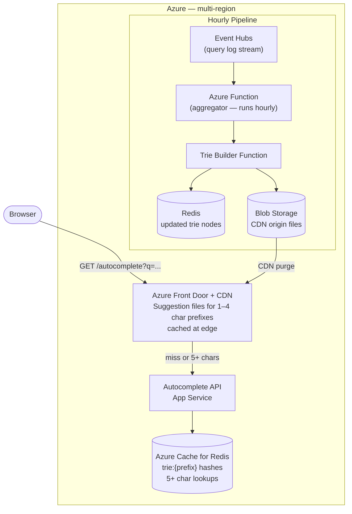

*[Grokking System Design](../../../README.md) · Module 5 — Designing Real Systems · Day 19*

# Day 19 — Search Autocomplete

> **Today's one idea:** Autocomplete is a pre-computation problem disguised as a real-time search problem — the magic of instant prefix suggestions is not fast lookup at query time, but a background pipeline that continuously mines query logs, builds a ranked suggestion index, and pushes it to an edge-cached trie that responds in single-digit milliseconds.
> **Reading time:** ~40 min · **Prereqs:** Days 1–16 · **This is a synthesis day**
> **Primary source for today:** Xu, *System Design Interview*, Vol. 1 (Byte Code LLC, 2020) — Chapter 13, "Design a Search Autocomplete System"

---

## Step 1 — Requirements

### Functional requirements
1. As a user types in a search box, display the **top 5 suggestions** matching the current prefix.
2. Suggestions are **ranked by popularity** (global query frequency over the past 7 days).
3. Support queries of up to **50 characters**.
4. System learns from queries — a new trending term must appear in suggestions **within 1 hour**.
5. Support **Unicode / international characters**.

### Non-functional requirements (priority order)
1. **Latency:** Suggestion response p99 < 50ms, including network round-trip from the user's region.
2. **Availability:** 99.9%. Stale suggestions are acceptable; returning an error is not.
3. **Scalability:** 10M active users; 100M searches/day; each user triggers ~5 partial keystrokes per search = **500M autocomplete requests/day** (~5,800/second).
4. **Freshness:** New terms appear in suggestions within 1 hour (not real-time).

### Out of scope
- Full search results (this is autocomplete only, not search).
- Personalisation (same suggestions for everyone searching the same prefix).

---

## Step 2 — Capacity Estimation

```
Requests: 500M/day ÷ 86,400 ≈ 5,800/second (peak ~3× = 17,400/second)

Trie storage:
  50 characters max prefix × 26 letters (simplified) = ~10M trie nodes
  Per node: prefix string (avg 10 bytes) + top-5 suggestions (5 × 100 bytes) = ~510 bytes
  Total: 10M × 510 bytes ≈ 5 GB
  → Fits in Redis Premium (or in-memory on edge nodes)

Query log ingestion:
  100M searches/day × ~50 bytes/query (search term + timestamp) = 5 GB/day
  → Azure Event Hubs, 7-day retention

Bandwidth:
  5,800 req/sec × 500 bytes/response (5 suggestions) ≈ 2.9 MB/second
  → Negligible; response size is tiny
```

---

## Step 3 — The Data Structure: The Trie

A **trie** (prefix tree) is the natural data structure for autocomplete. Each node represents one character; the path from the root to a node represents a prefix. Each node stores the top-K most popular suggestions that start with that prefix.

```
Input queries and frequencies:
  "apple"   → 5,000
  "app"     → 3,000
  "application" → 1,200
  "apply"   → 800
  "apt"     → 600

Trie (each node shows prefix and stored top-3 suggestions):

root
 └── 'a' [apple:5000, app:3000, application:1200]
      └── 'p' [apple:5000, app:3000, application:1200]
           ├── 'p' (a-p-p) [apple:5000, app:3000, application:1200]
           │    ├── (leaf: "app")
           │    ├── 'l' [apple:5000, application:1200, apply:800]
           │    │    ├── 'e' (leaf: "apple")
           │    │    ├── 'i' → ... → (leaf: "application")
           │    │    └── 'y' (leaf: "apply")
           │    └── 't' → ...
           └── 't' [apt:600]
```

**Key property:** each node stores the top-5 suggestions for its prefix. A lookup for prefix "app" returns the stored top-5 at the "app" node — O(length_of_prefix) time, regardless of how many terms share that prefix.

**Building the trie naively is expensive.** Traversing the entire subtree of a node to find the top-5 suggestions is O(subtree_size) — prohibitive at scale. The solution: pre-compute and store the top-5 at **every node** during trie construction (offline), not at query time.

---

## Step 4 — Options Considered

### Decision A: Where do we serve autocomplete requests?

**Option 1 — Centralised API server + in-memory trie**
Each App Service instance loads the full trie into memory. All requests hit one of N instances.
- Memory per instance: ~5 GB. Fine for a large instance.
- Latency: 5–20ms per request (no network to a separate store).
- Problem: updating the trie requires reloading it in-memory across all instances. Coordinating rolling reload without request loss is complex.

**Option 2 — Redis + centralised API**
Trie nodes stored in Redis as hashes. API fetches node on each character.
- Consistent across all API instances (one Redis).
- Trie update: write new node values to Redis; API immediately serves updated suggestions.
- Latency: 5–10ms per Redis round-trip, per character. For a 5-character prefix: 5 round-trips = 25–50ms. Borderline for our 50ms SLA.

**Option 3 — CDN / edge cache + precomputed suggestion files**
Pre-generate a JSON file for each distinct prefix (e.g., `suggestions/ap.json`, `suggestions/app.json`). Serve from CDN.
- Latency: 1–5ms from CDN edge node.
- Update: re-generate the file, push to CDN origin, CDN serves updated version within 60s.
- Storage: 26 + 26² + 26³ = 18,278 files for 1–3 character prefixes (covers 95% of queries). For 4+ characters, fall back to API.

**Trade-off matrix:**

| Option | Read latency | Update complexity | Scalability | Cost |
|--------|-------------|-------------------|-------------|------|
| 1 — In-memory | 5 | 2 (rolling reload) | 4 | 3 |
| 2 — Redis | 3 | 5 (atomic update) | 5 | 3 |
| 3 — CDN + files | 5 | 3 (file push) | 5 | 5 |

**Decision: Hybrid — CDN for short prefixes (1–4 chars), Redis for longer prefixes.**

Short prefixes (1–4 chars) account for ~70% of autocomplete requests and have a small, bounded set of suggestion files. CDN caching delivers them at <5ms globally. Long prefixes (5+ chars) are handled by an API that looks up the pre-built trie in Redis.

---

### Decision B: How do we keep suggestions fresh?

Requirements: new trending terms appear within 1 hour.

**Option 1 — Real-time trie update**
Every search query triggers a trie update. At 100M searches/day = 1,160 writes/second against a shared trie structure.
- Problem: trie updates require locking the affected node's subtree. Concurrent writes cause contention. Lock contention at 1,160/second degrades read latency.

**Option 2 — Batch update pipeline (every 1 hour)**
1. Query logs stream into Azure Event Hubs.
2. Every hour, an Azure Function runs: aggregate query frequencies from the past 7 days.
3. Rebuild the trie from the aggregated data.
4. Push updated trie to Redis + regenerate CDN suggestion files.
5. CDN serves new files within 60 seconds.

**Scoring:**
- Read performance: 5 — no contention; reads and writes to trie are separated.
- Freshness: 4 — new terms appear within ~65 minutes (1-hour batch + CDN propagation).
- Complexity: 4 — simple pipeline; each step is independently testable.

**Decision: Option 2 — hourly batch pipeline.** The 1-hour freshness requirement matches a batch cadence precisely. Real-time trie updates add complexity without meeting a stated requirement.

---

## Step 5 — Component Design

### The full system



### Query log → trie pipeline



### Trie node in Redis

```
Key:   trie:{prefix}     (e.g., trie:app)
Type:  Hash
Value: {
  "s1": "apple",       "f1": "5000",
  "s2": "app",         "f2": "3000",
  "s3": "application", "f3": "1200",
  "s4": "apply",       "f4": "800",
  "s5": "apt",         "f5": "600"
}
TTL:   90 minutes (slightly longer than update cadence — always warm)
```

### CDN suggestion file format

```json
// https://cdn.myapp.com/autocomplete/app.json
{
  "prefix": "app",
  "suggestions": [
    { "term": "apple",       "score": 5000 },
    { "term": "app",         "score": 3000 },
    { "term": "application", "score": 1200 },
    { "term": "apply",       "score": 800  },
    { "term": "apt",         "score": 600  }
  ],
  "generatedAt": "2026-05-13T09:00:00Z"
}
```

CDN `Cache-Control: public, max-age=3600` (1 hour). After the hourly pipeline runs, a targeted CDN purge refreshes only the prefixes that changed.

---

## Step 6 — C4 Container Diagram



---

## Step 7 — What We'd Do Differently at 10× Scale

At 5B autocomplete requests/day:

1. **Trie sharded across Redis cluster.** At 5B requests/day = 58,000/second, a single Redis instance is a bottleneck. Shard the trie by prefix first-character: `trie:a*` → Redis shard 0, `trie:b*` → shard 1, etc.

2. **Real-time aggregation for trending terms.** Azure Stream Analytics reads from Event Hubs in real-time and maintains a sliding 24-hour window of query frequencies. A separate "trending" trie updates every 5 minutes for viral/breaking terms. The serving layer merges the stable (hourly) trie and the trending (5-minute) trie at query time.

3. **Personalised suggestions.** Top-5 global suggestions feel generic for a logged-in user who has searched for "Azure Cosmos DB" 20 times. A lightweight personalisation layer re-ranks the global top-5 using a user's query history stored in Redis: `user-search-history:{userId}` as a recent sorted set. No need to rebuild the trie — just reorder the global top-5 before returning.

4. **Spell correction.** Type "appel" → suggest "apple." This requires fuzzy prefix matching (edit distance ≤ 1). At scale: precompute spell-correction tables for common misspellings; store as a parallel lookup alongside the trie.

---

## Try It Yourself

**Design challenge:** A malicious user discovers that by searching for the same harmful term millions of times, they can make it appear in the top-5 autocomplete suggestions globally. How do you prevent this?

<details>
<summary>Worked answer</summary>

**Attack:** 5,000 requests/second for "harmful_term" from a botnet inflates its frequency count in the query log. After the hourly pipeline, it appears as a top-5 suggestion for its prefix.

**Defences (layered):**

1. **Rate limiting per user/IP in the Search API.** [(Day 11)](../../03-compute-communication-building-blocks/days/day-11-rate-limiting-resilience.md) — a single user/IP can't contribute more than N queries per hour to the frequency count. Each deduplicated query contributes exactly 1 to the count, regardless of how many times the same user searches for it.

2. **Distinct-user count, not raw count.** When building the frequency map, count `distinct_user_count` (using HyperLogLog in Redis or approximate distinct counts in the aggregation pipeline) rather than raw query count. A term searched by 50,000 distinct users outranks one searched 10M times by 50 users.

3. **Content moderation filter.** Before writing a new term into the trie, pass it through a content moderation API (Azure AI Content Safety). Block suggestions matching a blocklist. This is a post-processing step in the Trie Builder function.

4. **Anomaly detection.** Alert if a previously unseen term reaches the top-1000 within 1 hour. A human or automated review gate can pause its inclusion in the trie until validated.

The combination of rate limiting + distinct-user scoring makes coordinated inflation attacks economically impractical (attacker needs millions of distinct IPs/accounts to inflate scores meaningfully).

</details>

---

## Suggested Readings for Today

**Required if you have 15 extra minutes:**
Xu, *System Design Interview* Vol. 1 — Chapter 13, "Design a Search Autocomplete System" (pp. 155–175). Xu's treatment focuses on trie data structure construction in depth and covers the optimised trie with top-K storage at each node. Read his "Data Gathering Service" section (pp. 165–168) for an alternative batch pipeline design.

**If you want the deep version:**
Kleppmann, *DDIA* — Chapter 3, "Storage and Retrieval," section "Other Indexing Structures" (pp. 85–90), specifically on column-family stores and in-memory data structures for special read patterns. The trie is a special-purpose read-optimised index — this section provides the theoretical framing for why pre-computation is the right approach when reads vastly outnumber writes.

---

← [Day 18 — Social Media Feed](day-18-social-media-feed.md) &nbsp;|&nbsp; [Day 20 — Rest & Synthesise II →](day-20-rest-synthesise-ii.md)
