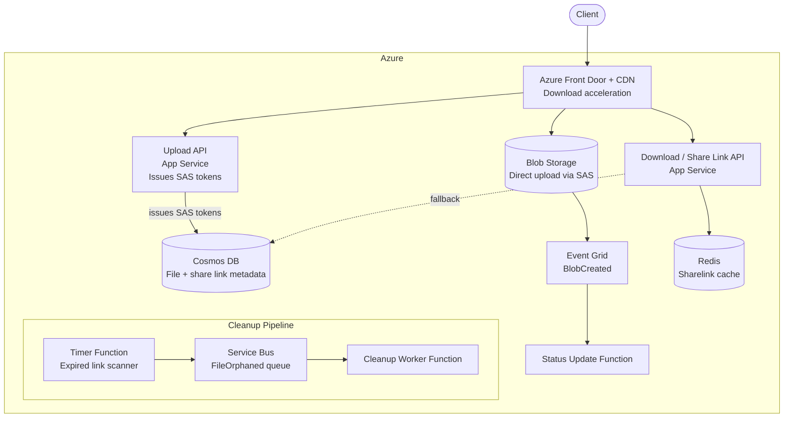
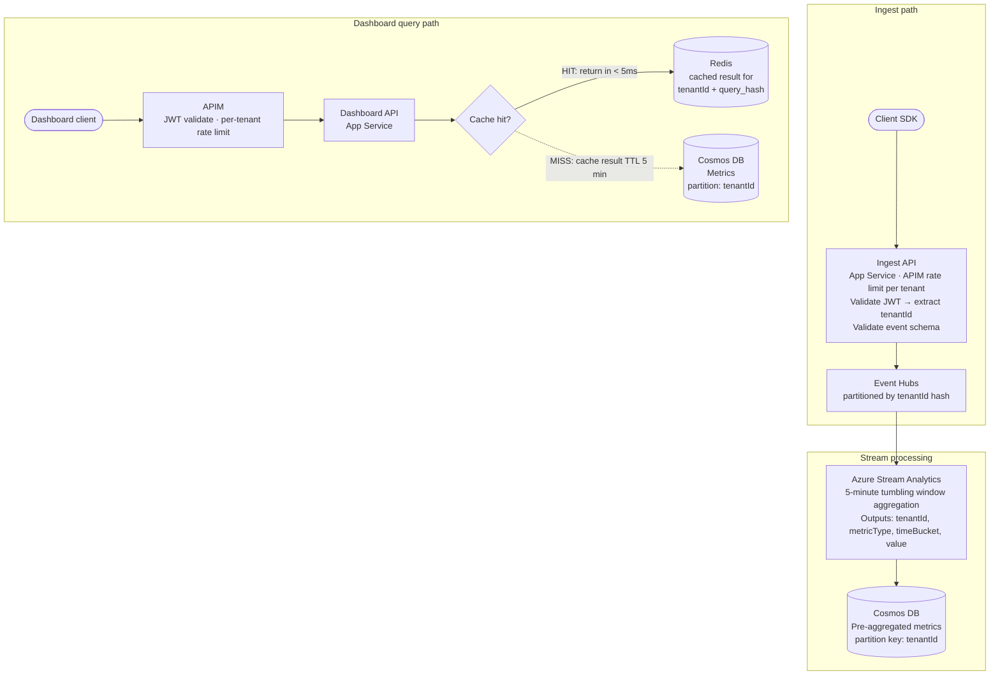

*[Grokking System Design](../../../README.md) · Module 5 — Designing Real Systems · Day 21*

# Day 21 — Capstone

> **Today's one idea:** System design is a skill, not a subject — and skills are built by doing. This page gives you the brief; you produce the design.
> **Time budget:** 60–90 minutes (this is a working session, not a reading session)
> **Prereqs:** All 20 prior days — the whole course is the prerequisite

---

## What This Day Is

This is your Feynman test. Close every tab. Open a blank document. Design a system you've never been walked through, using everything you've built over the past 20 days.

There are three briefs below — choose one (or let your manager/interviewer choose). The worked answer is provided for reference *after* you have written your own. Do not read the guided answer first. The gap between your design and the guided answer is the most important information this course can give you.

**What "done" looks like:**
- Functional requirements and NFRs stated explicitly, with quality attribute priority order.
- Capacity estimation: QPS, storage, bandwidth — at least rough numbers.
- For every major component decision: options considered, trade-off matrix, decision + justification citing quality attribute priorities.
- A C4 Container diagram (text/ASCII is fine) showing all services, their Azure implementations, and connections.
- At least one "What breaks at 10× scale and how you'd address it" observation.
- A degradation contract for the top 2 non-critical dependencies.

---

## Brief A — Rate-Limited File Sharing Service

**The brief:**
Design a file-sharing service for enterprise use. Users can upload files up to 5 GB. Files can be shared via a link (publicly accessible, no login required) or with specific users (requires authentication). Links expire after a configurable duration (1 hour to 30 days). The file is deleted from storage when the link expires and no other shares exist. Large organisations may have 100,000 employees uploading and downloading simultaneously.

**Hint (before you start, not during):** This design involves Blob Storage (Day 7), CDN (Day 7), Azure APIM rate limiting (Day 9), Cosmos DB for file metadata and share links (Day 5), Redis for fast link validation (Day 6), Azure AD for authentication, and Azure Service Bus for async deletion cleanup (Day 10).

---

## Brief B — Real-Time Collaborative Document Editing

**The brief:**
Design the backend for a real-time collaborative document editor (think Google Docs). Multiple users can edit the same document simultaneously. Changes from one user appear on all other users' screens within 500ms. Documents are persisted — a user who refreshes the page sees their latest changes. The system must handle 1 million active documents at any time, with an average of 3 simultaneous editors per document.

**Hint:** This design involves operational transforms or CRDT conflict resolution (Day 13 — AP system), WebSocket/SignalR for real-time updates, Azure Cache for Redis as the in-memory document state, Cosmos DB for durable persistence, and Azure Service Bus for broadcasting changes to all connected editors.

---

## Brief C — Multi-Tenant SaaS Metrics Dashboard

**The brief:**
Design the backend for a SaaS product analytics dashboard. Customer applications send telemetry events (page views, clicks, conversions) to an ingestion API. Customers can view dashboards showing aggregate metrics (daily active users, conversion rate, funnel drop-off) for their own data. Ingestion load: 50,000 events/second across all tenants. Dashboard query load: 10,000 queries/second. Dashboards show data that is at most 5 minutes stale. Strict tenant isolation: one tenant must never see another's data.

**Hint:** This design involves Event Hubs (Day 10) for ingestion, Azure Stream Analytics or Azure Data Explorer for real-time aggregation, Cosmos DB or Azure SQL for pre-aggregated metrics, Redis for cached dashboard results, Azure API Management with per-tenant rate limiting (Day 11), and Cosmos DB partition key strategy for tenant isolation (Day 5).

---

## The Guided Answer — Brief A (File Sharing Service)

*Read only after completing your own design.*

<details>
<summary>Guided answer — Brief A</summary>

### Requirements

**Functional:**
1. Upload files up to 5 GB.
2. Generate a share link (public or user-specific).
3. Links expire after 1 hour to 30 days (configurable).
4. Download file via share link (public: no auth; user-specific: requires login).
5. Auto-delete file from storage when all share links expire and no other references exist.
6. Show upload/download progress for large files.

**Non-functional (priority order):**
1. **Durability:** Files must never be silently lost. A stored file must be retrievable for its full link lifetime.
2. **Availability:** 99.9%. Upload and download must work independently — if metadata lookup is slow, downloads already in progress should not fail.
3. **Scalability:** 100,000 concurrent users; 50,000 files/day (avg 100 MB each) = 5 TB/day ingested.
4. **Security:** Public links must not be guessable; user-specific links must enforce authentication.

### Capacity Estimation

```
Uploads: 50,000 files/day ÷ 86,400 ≈ 0.58/second (peaks ~5× = 3/second)
File size: average 100 MB, max 5 GB
Storage: 50,000 × 100 MB × 365 days = ~1.8 PB/year
  → Lifecycle management: Hot (0–7 days), Cool (7–30 days), Archive (>30 days)

Downloads: files are shared widely; assume 10 downloads per upload = 500,000/day
  ≈ 6/second; CDN handles repeat downloads

Share link metadata:
  50,000 links/day × 365 × 5 years × 500 bytes = ~45 GB
  → Fits in Cosmos DB
```

### Major Decision: Upload path

**Option A — Upload via API server (API receives bytes, writes to Blob)**
Every upload streams through an App Service instance. At 3 uploads/second × avg 100 MB = 300 MB/second of bandwidth through App Service. Requires large, expensive instances. Scales poorly for 5 GB files.

**Option B — Direct-to-Blob upload using SAS token**
API generates a time-limited SAS token. Client uploads directly to Blob Storage. API receives completion notification via Event Grid `BlobCreated` trigger.

**Decision: Option B.** [(Day 7 — SAS token direct-upload pattern.)](../../02-storage-building-blocks/days/day-07-blob-cdn-search.md) API never handles bytes. Blob Storage scales to petabytes natively.

### Major Decision: Share link validation

**Option A — Cosmos DB lookup on every request**
Every download request queries Cosmos DB for the share link record.
- Latency: 5–10ms per lookup.
- Problem: a viral file shared publicly creates 100K simultaneous downloads = 100K Cosmos DB reads/second → expensive.

**Option B — Redis cache for active share links**
Active share links cached in Redis with TTL = link expiry duration.
- Cache hit = 1ms. Cache miss (expired or first load) falls back to Cosmos DB.
- A viral file with 1M downloads hits Redis once per cache entry lifetime.
- On link expiry, the Redis key automatically disappears (TTL).

**Decision: Option B.** [(Day 6 — Cache-Aside pattern; Redis as fast link validator.)](../../02-storage-building-blocks/days/day-06-caching.md)

```
Redis key:    sharelink:{linkToken}
Value hash:   { fileId, expiresAt, ownerId, isPublic, downloadCount }
TTL:          (expiresAt - now) seconds
```

### Major Decision: File deletion

Files should be deleted when all share links expire. Share links expire at different times. Checking "has every link expired?" on every link expiry is expensive.

**Solution: Reference counter + async cleanup**

Cosmos DB file record:
```json
{
  "fileId": "file-uuid",
  "blobPath": "uploads/2026/05/file-uuid.pdf",
  "activeShareCount": 2,   // incremented on link creation, decremented on expiry
  "deletedAt": null
}
```

When a share link expires:
1. Redis key TTL fires → link is gone from cache.
2. An Azure Timer Function runs every 5 minutes: find share link records where `expiresAt < now AND status != deleted`.
3. Decrement `activeShareCount` on the file record (atomic with Cosmos optimistic concurrency).
4. If `activeShareCount == 0`: publish `FileOrphaned` event to Service Bus.
5. Cleanup Worker receives `FileOrphaned` → calls Blob Storage delete → marks file `deletedAt`.

### Component Design



```mermaid
flowchart TD
    subgraph Upload["Upload flow"]
        C1(["Client"])
        UpAPI["API\nPOST /uploads\nGenerate blob path + SAS token\nCreate file record in Cosmos DB\nReturn uploadUrl + fileId"]
        BlobUp[("Blob Storage\ndirect PUT with SAS token")]
        EG["Event Grid\nBlobCreated"]
        StatusFn["API Function\nUpdate file status: active"]

        C1 --> UpAPI --> BlobUp
        BlobUp --> EG --> StatusFn
    end

    subgraph Download["Download flow"]
        C2(["Client"])
        CDN["CDN / Front Door"]
        Validator["Share Link Validator API"]
        RCheck{"Redis\nsharelink:{token}"}
        CosmosLookup[("Cosmos DB\nfallback lookup")]
        SASGen["Generate short-lived\nread SAS for Blob → redirect"]

        C2 --> CDN --> Validator --> RCheck
        RCheck -->|HIT: validate expiry + auth| SASGen
        RCheck -. MISS .-> CosmosLookup --> SASGen
    end

    subgraph Cleanup["Expiry / cleanup flow"]
        Timer["Timer Function\nevery 5 min\nFind expired share links"]
        Decrement["Decrement file.activeShareCount\nCosmos atomic"]
        Check{"activeShareCount\n== 0?"}
        SB["Service Bus\nFileOrphaned"]
        Worker["Cleanup Worker\nDelete blob\nMark file deleted in Cosmos DB"]

        Timer --> Decrement --> Check
        Check -->|yes| SB --> Worker
    end
```

### C4 Container Diagram



### Degradation Contract

| Dependency | Failure | Fallback | User experience |
|-----------|---------|---------|----------------|
| Redis (share link cache) | Unavailable | Cosmos DB direct lookup (~10ms) | Slightly slower downloads; transparent to user |
| Event Grid (upload notification) | Delayed | Timer Function polls for `status=pending` blobs older than 5 min, marks active | File appears "processing" for up to 5 min after upload |

### At 10× Scale

- Cosmos DB `activeShareCount` becomes a hot document if millions of simultaneous downloads trigger concurrent reads. Move counter to Redis (INCR/DECR is atomic and sub-millisecond) and sync to Cosmos DB asynchronously.
- Blob Storage lifecycle management: `Hot → Cool` after 7 days (most files are downloaded in the first week), `Cool → Archive` after link expiry, `Archive → delete` after cleanup confirmation.

</details>

---

## The Guided Answer — Brief C (Multi-Tenant Metrics Dashboard)

*Read only after completing your own design.*

<details>
<summary>Guided answer — Brief C</summary>

### Requirements

**Functional:**
1. Ingest telemetry events (page views, clicks, conversions) via HTTP API.
2. Store raw events for up to 90 days.
3. Pre-aggregate metrics by tenant: DAU, conversion rate, funnel steps — updated within 5 minutes.
4. Serve dashboard queries: time-range aggregations over a tenant's metrics.
5. Strict tenant isolation: tenant A cannot access tenant B's data.

**Non-functional (priority order):**
1. **Scalability:** 50,000 events/second ingest; 10,000 dashboard queries/second.
2. **Latency:** Dashboard queries < 200ms. Ingestion acknowledgement < 50ms.
3. **Availability:** 99.9%. Dashboard reads must work even if ingestion pipeline is lagging.
4. **Security:** Tenant isolation is a hard constraint — a data leak is a product-ending event.

### Capacity Estimation

```
Ingest: 50,000 events/second
  Event size: ~200 bytes
  Throughput: 10 MB/second → Event Hubs handles this (up to 40 MB/s per namespace)
  
Raw event storage (90 days):
  50,000 events/s × 86,400 s × 90 days × 200 bytes ≈ 77.8 TB
  → Azure Data Explorer (Kusto) — designed for this exact pattern

Pre-aggregated metrics:
  Assume 10,000 tenants × 100 metric series × 1 data point/minute × 200 bytes = 12 GB/day
  → Cosmos DB (Core SQL) — fast point lookups by tenantId + metric + time bucket
```

### Tenant Isolation Strategy

**Cosmos DB partition key = `tenantId`.** Every query is scoped to a partition key — no cross-tenant data access is physically possible within a single-partition query. Application-level validation: extract `tenantId` from JWT claim, never accept it from the request body.

**Event Hubs: one consumer group per tenant type is overkill.** Partition by `tenantId % N_partitions`. A stream processing worker processes one partition and writes to the tenant's Cosmos DB container. The worker must filter and validate `tenantId` in every event.

### Component Design



### Degradation Contract

| Dependency | Failure | Fallback |
|-----------|---------|---------|
| Stream Analytics pipeline | Lag > 5 min | Dashboard shows "Data may be up to X min old" banner. Raw events in Event Hubs; pipeline catches up on recovery. |
| Redis (dashboard cache) | Unavailable | Cosmos DB direct query (~20–50ms). Dashboard slower but correct. |

### At 10× Scale

- 500,000 events/second requires Event Hubs Premium with 40 throughput units (40 MB/s capacity).
- Cosmos DB pre-aggregated metrics under 100,000 tenant × 10,000 queries/second → sharded by `tenantId % 10` into 10 Cosmos DB accounts (multi-tenancy isolation at the account level for the largest tenants).
- Hot-path caching: most dashboards are refreshed every 30 seconds by multiple users in the same tenant — a single Redis entry per `{tenantId}:{queryHash}` serves all concurrent users.

</details>

---

## After the Capstone

You have completed the 21-day course. Here is what you can now do that you couldn't on Day 1:

1. **Decompose any system** into functional requirements, NFRs, and capacity estimates in under 10 minutes.
2. **Select the right storage building block** for any access pattern — relational, document, key-value, wide-column, graph, blob, CDN, search.
3. **Design the communication layer** — load balancing, API protocol, async messaging — with explicit failure mode analysis.
4. **Apply the CAP trade-off consciously** — know which consistency level you're choosing and why.
5. **Design for failure** — degradation contracts, circuit breakers, chaos experiments, Saga patterns.
6. **Draw a C4 Container diagram** that communicates your design clearly to a mixed audience.
7. **Write an ADR** that justifies every major decision in a format that survives team turnover.

---

## What to Read Next

This course brought you to L1/L2 competency. The frontier from here:

**For deeper system design practice:**
- Xu, *System Design Interview*, Vol. 2 (Byte Code LLC, 2022) — Chapters on Google Drive (file sharing), YouTube (video streaming), and distributed message queue.
- *Grokking the System Design Interview* (educative.io) — additional worked examples.

**For distributed systems depth:**
- Kleppmann, *DDIA* — Chapters 8 and 9 ("The Trouble with Distributed Systems" and "Consistency and Consensus"). You've seen the applications; now read the theory in full.
- MIT 6.824 Distributed Systems lectures (free on YouTube, 2020 version) — Raft consensus, Spanner, Zookeeper.

**For Azure architecture specifically:**
- Azure Architecture Center — "Cloud Design Patterns": [https://learn.microsoft.com/en-us/azure/architecture/patterns/](https://learn.microsoft.com/en-us/azure/architecture/patterns/). 40+ patterns with Azure-specific implementation guidance. Bookmark and read one pattern per week.
- Azure Well-Architected Framework: [https://learn.microsoft.com/en-us/azure/well-architected/](https://learn.microsoft.com/en-us/azure/well-architected/). The five pillars (Reliability, Security, Cost Optimisation, Operational Excellence, Performance Efficiency) — the official Azure framework for production-grade system review.

**For .NET implementation depth:**
- Newman, *Building Microservices* (O'Reilly, 2021, 2nd ed.) — Service decomposition, API versioning, distributed tracing, and observability in production microservice architectures.

---

## A Final Note

The goal of this course was stated on Day 1: *given any system design question for an Azure-hosted .NET application, produce a justified HLD with the right building blocks and the right trade-off rationale.*

You have the tools. The next step is repetition — one new system design problem per week, using the Day 1 methodology and the Day 20 pattern-matching cheat sheet. The gap between knowing the framework and applying it fluently closes with practice, not with more reading.

Go build something.

---

← [Day 20 — Rest & Synthesise II](day-20-rest-synthesise-ii.md)
