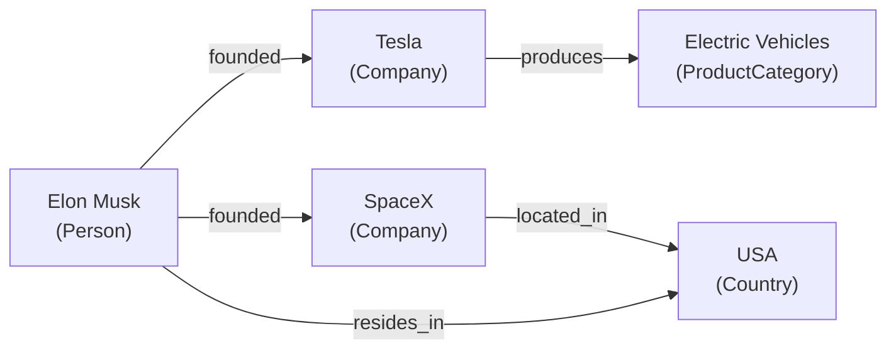

*[Knowledge Graphs: From Concept to Production](../README.md) · Day 1 of 15*

# Day 1 — What Is a Knowledge Graph?

> **Today's one idea:** A knowledge graph is a directed, labeled multigraph where edges carry *named semantics* — not just connections, but meaning.
> **Reading time:** ~35 min · **Prereqs:** None
> **Primary source for today:** Hogan, Aidan et al. *Knowledge Graphs.* MIT Press, 2021. Chapter 1, §1.1–1.3 (pp. 1–18). Free preprint: arXiv:2003.02320.

---

## The hook (2–4 min)

In 2012, Google replaced its search sidebar with something new. Before: a list of pages mentioning "Albert Einstein." After: a panel — *Albert Einstein · Theoretical Physicist · Born: 14 March 1879, Ulm, Germany · Spouse: Elsa Einstein · Employer: Princeton University.*

That shift — from "here are documents that mention this name" to "here are *facts* about this entity" — was powered by the Google Knowledge Graph. Google had stopped indexing text and started indexing structured knowledge.

You've already built systems that retrieve text (RAG) and systems that find similar embeddings (vector search). Now ask yourself: when your agent needs to answer *"Who are the direct reports of the VP of Engineering who also worked at companies that received Series B funding from investors headquartered in the USA?"* — does it look for *similar sentences*, or does it traverse a *structure of connected facts*?

Plain vector RAG cannot answer this. It has no concept of "direct report of" or "received funding from." A knowledge graph can, because it stores those connections explicitly, as named, traversable edges. That's what you're here to build.

---

## Building the intuition (10–15 min)

Start with a Python dict — something you've written a hundred times:

```python
data = {
    "Elon Musk": {"type": "Person", "works_at": "Tesla"},
    "Tesla":     {"type": "Company", "founded_by": "Elon Musk"},
}
```

This captures two facts. But answering "what companies did Elon Musk found?" requires scanning every key looking for `founded_by` values equal to "Elon Musk." Extend this to 10,000 entities and it becomes a full-table scan. Add ten relationship types and you have ten separate indices to maintain.

A knowledge graph inverts this. Instead of storing relationships *inside* nodes as properties, it stores them *between* nodes as named, directed edges:

```
[Elon Musk] --founded--> [Tesla]
[Elon Musk] --founded--> [SpaceX]
[Tesla]     --produces--> [Electric Vehicles]
[SpaceX]    --located_in--> [USA]
[Elon Musk] --resides_in--> [USA]
```

The label on the edge *is* the fact. The nodes are the participants.



Three properties make this architecture powerful:

**1. Edges are first-class citizens.** In a relational database, relationships are encoded as foreign keys — they're implicit. In a KG, the relationship *is* the data. `founded` is not a column; it's a typed fact between two entities.

**2. Heterogeneous types coexist naturally.** Persons, companies, products, and countries live in the same graph without schema conflicts. Adding a new entity type costs nothing.

**3. Multi-hop queries are traversals, not JOINs.** "Products made by companies Elon Musk founded" becomes: follow `founded` edges out of `Elon Musk` → collect {Tesla, SpaceX} → follow `produces` edges → collect results. No table join, no foreign key lookup. Just path-following.

Here is that exact query in Python using NetworkX — a library you likely already have:

```python
import networkx as nx

# pip install networkx  (already in most ML environments)

kg = nx.MultiDiGraph()  # Multi = multiple edge types between same pair of nodes

# Add entities (nodes) with type metadata
kg.add_nodes_from([
    ("Elon Musk",         {"type": "Person"}),
    ("Tesla",             {"type": "Company"}),
    ("SpaceX",            {"type": "Company"}),
    ("Electric Vehicles", {"type": "ProductCategory"}),
    ("USA",               {"type": "Country"}),
])

# Add relationships (labeled edges)
kg.add_edge("Elon Musk", "Tesla",             relation="founded")
kg.add_edge("Elon Musk", "SpaceX",            relation="founded")
kg.add_edge("Tesla",     "Electric Vehicles", relation="produces")
kg.add_edge("SpaceX",    "USA",               relation="located_in")
kg.add_edge("Elon Musk", "USA",               relation="resides_in")

# Helper: follow edges of a specific type from a node
def follow(graph, node, relation):
    return [
        target
        for _, target, data in graph.out_edges(node, data=True)
        if data.get("relation") == relation
    ]

# Single-hop: what did Elon Musk found?
founded = follow(kg, "Elon Musk", "founded")
print(f"Founded: {founded}")
# → ['Tesla', 'SpaceX']

# Multi-hop: what does Elon Musk's network produce?
products = [p for company in founded for p in follow(kg, company, "produces")]
print(f"Produces: {products}")
# → ['Electric Vehicles']
```

Run this. The code reads like its intent. You aren't writing SQL; you're traversing a structure.

---

## The formal picture (10–15 min)

Now that you can feel the shape, here is the definition.

A **knowledge graph** is a directed labeled multigraph:

```
KG = (V, E, L, φ)
```

- **V** — a set of *vertices* (entities)
- **E ⊆ V × V** — a set of directed *edges*
- **L** — a set of *labels* (relation types)
- **φ: E → L** — a labeling function assigning each edge exactly one label

The "multi" in multigraph means multiple distinct edges can connect the same pair of nodes. `(Alice, manages, Bob)` and `(Alice, mentors, Bob)` are both valid simultaneously.

In practice, KGs are described as sets of **triples** (also called *facts*):

```
(head, relation, tail)    ←— ML / embeddings literature
(subject, predicate, object)  ←— semantic web / RDF literature
```

Both mean the same thing. You'll see both notations in this course.

| head | relation | tail |
|------|----------|------|
| Elon Musk | founded | Tesla |
| Elon Musk | founded | SpaceX |
| Tesla | produces | Electric Vehicles |
| SpaceX | located_in | USA |

The entire KG is the union of all its triples. Every query is a question over this set.

**How a KG compares to what you already use:**

| | Relational DB | Vector Store | Plain Graph | Knowledge Graph |
|---|---|---|---|---|
| Primary unit | Row in a table | Vector + distance | Node + edge | Entity + *named* relation |
| Typical query | SQL JOIN | k-NN similarity | Path traversal | *Typed* path traversal |
| Schema | Fixed, enforced | None | None to minimal | Typed, optional enforcement |
| Multi-hop | Painful (JOINs) | No | Yes | Yes, with semantics |
| Heterogeneous types | Awkward | Invisible | Possible | Natural |
| Answers "what is similar?" | No | Yes | No | No (use vector store for that) |
| Answers "how are they connected?" | Indirectly | No | Yes | Yes, with named hops |

Your RAG pipeline uses a vector store because it's optimised for *"what text chunk is most similar to this query?"* A KG is optimised for *"what facts are connected to this entity, and through what relationships?"* In production systems — Days 9 and 10 — you will use both together.

---

## Where it breaks / what it is not (3–5 min)

**KGs assert, they don't validate.** A KG is only as correct as the facts you put in. If `(Elon Musk, founded, Tesla)` is in the graph, every query that traverses it will treat it as true. There is no built-in uncertainty unless you add it explicitly (e.g., as an edge property `confidence: 0.95`). Garbage in, confident garbage out.

**The Open World Assumption.** If `(Alice, works_at, Google)` is *not* in your KG, it does not mean Alice doesn't work at Google. It means *you don't know*. This is opposite to a relational database, where a missing row means the fact is false. Your agent must handle this difference explicitly — "I didn't find it in the graph" is not the same as "it doesn't exist."

**A KG is not an ontology.** An ontology is the *schema* — it defines what types of entities and relationships are allowed. A KG is the *data* — the actual facts. You can have a KG with no ontology (just raw triples), but it will be inconsistent and hard to query. Day 4 draws this distinction precisely.

**A KG is not magic reasoning.** A KG stores facts explicitly. It doesn't infer new facts unless you run an inference engine or write rules. `(Alice, parent_of, Bob)` and `(Bob, parent_of, Carol)` don't automatically imply `(Alice, grandparent_of, Carol)` unless you either add that triple or configure a reasoner. This surprises people coming from Prolog.

---

## Try it yourself (5–10 min)

**Exercise 1 — Draw it (L1):** Draw a 6-node knowledge graph about yourself. Include: yourself, your current project or employer, one technology you use, one city you're in. Use at least 4 distinct relationship types. Do this on paper before touching code.

**Exercise 2 — Code it (L1/L2):** Translate your drawn KG into NetworkX. Print all entities whose `type` is `"Company"` or `"Project"`.

<details>
<summary>Hint for Exercise 2</summary>

```python
matches = [n for n, d in kg.nodes(data=True) if d.get("type") in {"Company", "Project"}]
```
</details>

<details>
<summary>Solution for Exercise 2</summary>

```python
import networkx as nx

kg = nx.MultiDiGraph()

kg.add_nodes_from([
    ("You",       {"type": "Person"}),
    ("YourCo",    {"type": "Company"}),
    ("LangChain", {"type": "Tool"}),
    ("Neo4j",     {"type": "Tool"}),
    ("Delhi",     {"type": "City"}),
    ("India",     {"type": "Country"}),
])

kg.add_edge("You",    "YourCo",    relation="works_at")
kg.add_edge("You",    "LangChain", relation="uses")
kg.add_edge("You",    "Neo4j",     relation="uses")
kg.add_edge("You",    "Delhi",     relation="lives_in")
kg.add_edge("Delhi",  "India",     relation="located_in")
kg.add_edge("YourCo", "India",     relation="operates_in")

orgs = [n for n, d in kg.nodes(data=True) if d.get("type") == "Company"]
print(f"Companies: {orgs}")
```
</details>

**Exercise 3 — Stretch (L2):** Write a generalised `two_hop(kg, start, rel1, rel2)` function. Then: use it to find *"what countries are reachable from You via works_at then operates_in?"*

<details>
<summary>Solution for Exercise 3</summary>

```python
def follow(graph, node, relation):
    return [
        t for _, t, d in graph.out_edges(node, data=True)
        if d.get("relation") == relation
    ]

def two_hop(graph, start, rel1, rel2):
    return [
        target
        for mid in follow(graph, start, rel1)
        for target in follow(graph, mid, rel2)
    ]

print(two_hop(kg, "You", "works_at", "operates_in"))
# → ['India']
```
</details>

---

## Connect it back

You came in knowing what RAG is. You leave knowing why RAG has a structural blind spot: it retrieves *text chunks*, not *connected facts*. A knowledge graph stores connections explicitly, as named edges, making multi-hop questions answerable in a single traversal. Tomorrow you'll meet the smallest possible representation of a fact — the triple — and see why its simplicity is what makes large KGs composable across datasets.

**The question you can answer today that you couldn't this morning:** *Why can't a vector store answer "what companies were founded by someone who studied under a Fields Medal winner?" — and what would a KG need to answer it?*

---

## Suggested readings for today

**Required if you have 15 extra minutes:** Hogan et al., *Knowledge Graphs* (MIT Press, 2021), Chapter 1, §1.1–1.3, pp. 1–18. The free preprint is at arXiv:2003.02320 — search for "1 Introduction." Reads fast; establishes the full formal definition and situates KGs in the broader data landscape.

**If you want the deep version:**
- Leskovec, Jure. CS224W Lecture 1: "Introduction — Why Graphs?" (Stanford, 2021). First 20 minutes only. Available at cs224w.stanford.edu. Frames graph ML vs. other ML modalities — useful context for where KG embeddings (Day 11) will fit in your mental model.
- Hogan et al., §1.4 "Related Concepts" — explicitly distinguishes KGs from knowledge bases, ontologies, databases, and property graphs. Resolves several of the "is this the same as X?" questions you'll have after today.

---

[Day 2 — Triples: The Atomic Unit →](day-02-triples-atomic-unit.md)
