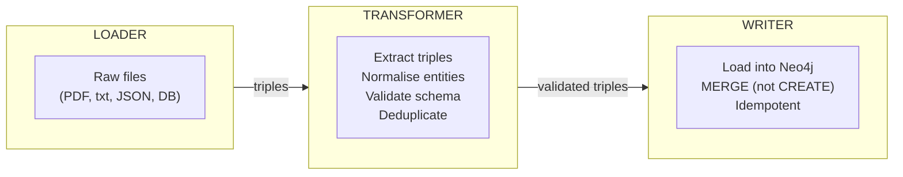

*[Knowledge Graphs: From Concept to Production](../README.md) · Day 8 of 15*

# Day 8 — The Ingestion Pipeline

> **Today's one idea:** A KG lives inside a three-stage pipeline — *Loader → Transformer → Writer* — and the quality of the KG is determined entirely by the quality of each stage; getting MERGE semantics and entity deduplication right is the difference between a maintainable graph and a corrupted one.
> **Reading time:** ~40 min · **Prereqs:** [Days 1–7](../README.md)
> **Primary source for today:** Robinson, Webber & Eifrem, *Graph Databases* (O'Reilly, 2015), Chapter 3 §3.3–3.4 and Chapter 4 §4.1. Free edition at neo4j.com/graph-databases-book/
> **Setup required:** Neo4j running locally (see [Day 6](day-06-rest-and-synthesize-i.md) setup section)

---

## The hook (2–4 min)

Day 7 gave you a working extractor: feed it a document, get back a list of triples. But triples are not a KG. They're raw material. Between "a list of Python dicts" and "a queryable Neo4j graph" lies a sequence of engineering decisions that most KG tutorials skip — and that every production KG project eventually has to solve the hard way:

- What if the same entity appears in 50 documents with 50 slightly different names?
- What if you run the pipeline twice on the same documents? Do you get duplicate nodes?
- What if a document mentions "Alice" who is a different person than "Alice" in another document?
- What if the extractor returns a triple with a null subject?

The ingestion pipeline is the answer to all of these. Its job: take messy, noisy, duplicated extractions and produce a clean, idempotent, queryable graph. Today you'll build one end-to-end.

---

## Building the intuition (10–15 min)

### The three-stage architecture



**Loader:** Reads source data into text chunks. Handles PDFs, markdown files, database records, API responses. Output: `[{"id": "doc1", "text": "..."}]`.

**Transformer:** Runs the Day 7 extractor, normalises entity names, validates triple schema (no null subjects/predicates), deduplicates. Output: `[Triple(subject, predicate, object, ...)]`.

**Writer:** Loads triples into Neo4j using `MERGE` — the idempotency guarantee. Output: nothing (side effects: Neo4j contains the facts).

### MERGE: the single most important Cypher command

The difference between `CREATE` and `MERGE`:

```cypher
-- CREATE always makes a new node
-- Run twice → two nodes named "Alice"
CREATE (:Person {name: "Alice"})

-- MERGE makes the node if it doesn't exist; matches it if it does
-- Run a hundred times → still exactly one node named "Alice"
MERGE (:Person {name: "Alice"})
```

For ingestion, **always use MERGE**. Every triple write should be idempotent: running the pipeline twice produces the same graph as running it once. This is critical for pipelines that process incremental document batches.

The full MERGE pattern for a triple `(Alice)-[:WORKS_AT]->(ToolaGen)`:

```cypher
MERGE (s:Person {name: "Alice"})
MERGE (o:Company {name: "ToolaGen"})
MERGE (s)-[r:WORKS_AT]->(o)
ON CREATE SET r.first_seen = datetime()
ON MATCH  SET r.last_seen  = datetime()
```

`ON CREATE SET` runs only when a new node/edge is created. `ON MATCH SET` runs when an existing one is matched. This lets you track when each fact first appeared and when it was last confirmed.

---

## The formal picture (10–15 min)

### Full pipeline implementation

```python
# pip install neo4j anthropic
from neo4j import GraphDatabase
from dataclasses import dataclass, field
from pathlib import Path
import json, anthropic, re

# ── Types ──────────────────────────────────────────────────────────────

@dataclass
class Triple:
    subject: str
    predicate: str
    object: str
    subject_type: str = "Entity"
    object_type: str = "Entity"
    source_id: str = ""

# ── Stage 1: Loader ────────────────────────────────────────────────────

class TextLoader:
    """Loads .txt and .md files from a directory."""

    def load(self, path: str) -> list[dict]:
        docs = []
        for p in Path(path).glob("**/*.{txt,md}"):
            docs.append({
                "id": str(p),
                "text": p.read_text(encoding="utf-8")
            })
        return docs

    def load_texts(self, texts: list[str]) -> list[dict]:
        """Load raw strings directly (for testing)."""
        return [{"id": f"text_{i}", "text": t} for i, t in enumerate(texts)]

# ── Stage 2: Transformer ───────────────────────────────────────────────

EXTRACTION_PROMPT = """Extract knowledge graph triples from this text.

Output ONLY a JSON array. Each element:
{{"subject": str, "predicate": str, "object": str, "subject_type": str, "object_type": str}}

Rules:
- predicate: snake_case, use only explicit relationships stated in the text
- subject_type / object_type: one of Person, Organisation, Software, Concept, Location, Event, Other
- Skip triples with null/empty subject or object

Text: {text}"""

class LLMExtractor:
    def __init__(self, model="claude-sonnet-4-6"):
        self.client = anthropic.Anthropic()
        self.model = model

    def extract(self, text: str) -> list[dict]:
        resp = self.client.messages.create(
            model=self.model,
            max_tokens=2048,
            messages=[{"role": "user",
                        "content": EXTRACTION_PROMPT.format(text=text[:4000])}]
        )
        raw = resp.content[0].text.strip()
        # Strip markdown fences
        raw = re.sub(r"```(?:json)?\n?", "", raw).strip().rstrip("`")
        try:
            return json.loads(raw)
        except json.JSONDecodeError:
            return []


class Transformer:
    def __init__(self, extractor: LLMExtractor):
        self.extractor = extractor
        self._entity_map: dict[str, str] = {}  # normalised → canonical

    def transform(self, docs: list[dict]) -> list[Triple]:
        all_triples = []
        for doc in docs:
            raw = self.extractor.extract(doc["text"])
            for r in raw:
                s = self._canonicalise(r.get("subject", "").strip())
                p = r.get("predicate", "").strip().lower().replace(" ", "_")
                o = self._canonicalise(r.get("object", "").strip())
                # Validate: skip empty or trivially short fields
                if len(s) < 2 or len(p) < 2 or len(o) < 2:
                    continue
                all_triples.append(Triple(
                    subject=s,
                    predicate=p,
                    object=o,
                    subject_type=r.get("subject_type", "Entity"),
                    object_type=r.get("object_type", "Entity"),
                    source_id=doc["id"],
                ))
        return all_triples

    def _canonicalise(self, name: str) -> str:
        """Fuzzy entity resolution: collapse near-duplicate names."""
        from difflib import SequenceMatcher
        key = name.lower().strip()
        best, best_score = name, 0.0
        for existing_key, canonical in self._entity_map.items():
            score = SequenceMatcher(None, key, existing_key).ratio()
            if score > best_score:
                best, best_score = canonical, score
        if best_score >= 0.88:
            self._entity_map[key] = best
            return best
        self._entity_map[key] = name
        return name

# ── Stage 3: Writer ────────────────────────────────────────────────────

class Neo4jWriter:
    def __init__(self, uri: str, user: str, password: str):
        self.driver = GraphDatabase.driver(uri, auth=(user, password))

    def write(self, triples: list[Triple], batch_size: int = 100) -> int:
        written = 0
        for i in range(0, len(triples), batch_size):
            batch = triples[i : i + batch_size]
            with self.driver.session() as session:
                session.execute_write(self._write_batch, batch)
            written += len(batch)
            print(f"  Written {written}/{len(triples)} triples...")
        return written

    @staticmethod
    def _write_batch(tx, triples: list[Triple]):
        for t in triples:
            tx.run("""
                MERGE (s {name: $subject})
                ON CREATE SET s.type = $subject_type, s :""" + t.subject_type + """
                MERGE (o {name: $object})
                ON CREATE SET o.type = $object_type, o :""" + t.object_type + """
                MERGE (s)-[r:""" + t.predicate.upper() + """]->(o)
                ON CREATE SET r.source = $source, r.first_seen = datetime()
                ON MATCH  SET r.last_seen = datetime()
            """, subject=t.subject, subject_type=t.subject_type,
                 object=t.object, object_type=t.object_type,
                 source=t.source_id)

    def close(self):
        self.driver.close()

    def node_count(self) -> int:
        with self.driver.session() as session:
            return session.run("MATCH (n) RETURN count(n) AS c").single()["c"]

    def edge_count(self) -> int:
        with self.driver.session() as session:
            return session.run("MATCH ()-[r]->() RETURN count(r) AS c").single()["c"]

# ── The Pipeline ───────────────────────────────────────────────────────

class KGIngestionPipeline:
    def __init__(self, neo4j_uri: str, neo4j_user: str, neo4j_pass: str):
        self.loader      = TextLoader()
        self.transformer = Transformer(LLMExtractor())
        self.writer      = Neo4jWriter(neo4j_uri, neo4j_user, neo4j_pass)

    def run(self, texts: list[str] = None, path: str = None) -> dict:
        # Stage 1: Load
        if texts:
            docs = self.loader.load_texts(texts)
        elif path:
            docs = self.loader.load(path)
        else:
            raise ValueError("Provide either texts= or path=")
        print(f"[Loader]      Loaded {len(docs)} documents")

        # Stage 2: Transform
        triples = self.transformer.transform(docs)
        print(f"[Transformer] Extracted {len(triples)} triples")

        # Stage 3: Write
        written = self.writer.write(triples)
        print(f"[Writer]      Wrote {written} triples to Neo4j")
        print(f"              Graph now has {self.writer.node_count()} nodes, "
              f"{self.writer.edge_count()} edges")
        return {"docs": len(docs), "triples": len(triples), "written": written}

    def close(self):
        self.writer.close()
```

### Running the pipeline end-to-end

```python
# Sample texts — replace with your own documents
sample_texts = [
    """LangChain was created by Harrison Chase in 2022. It is a Python framework 
    for building LLM applications. LangChain integrates with OpenAI, Anthropic, 
    and HuggingFace models.""",

    """LlamaIndex was founded by Jerry Liu. It focuses on RAG pipelines and 
    knowledge graph integration. LlamaIndex supports Neo4j as a graph store 
    for structured memory.""",

    """Harrison Chase and Jerry Liu both gave talks at AI Engineer World's Fair 2023. 
    Both frameworks support the Model Context Protocol introduced by Anthropic.""",
]

pipeline = KGIngestionPipeline(
    neo4j_uri="bolt://localhost:7687",
    neo4j_user="neo4j",
    neo4j_pass="password123",
)

stats = pipeline.run(texts=sample_texts)
pipeline.close()

print(f"\nResult: {stats}")
```

**Expected output:**
```
[Loader]      Loaded 3 documents
[Transformer] Extracted 11 triples
[Writer]      Written 11/11 triples...
              Graph now has 14 nodes, 11 edges

Result: {'docs': 3, 'triples': 11, 'written': 11}
```

### Verify in Neo4j Browser

Open `http://localhost:7474` and run:

```cypher
-- See the whole graph
MATCH (n)-[r]->(m) RETURN n, r, m LIMIT 50

-- What did LangChain creators build?
MATCH (p:Person)-[:CREATED_BY|FOUNDED_BY]-(f:Software)
RETURN p.name, f.name

-- Two-hop: frameworks that support the same models
MATCH (f1:Software)-[:INTEGRATES_WITH]->(m:Software)
     <-[:INTEGRATES_WITH]-(f2:Software)
WHERE f1 <> f2
RETURN f1.name, m.name, f2.name
```

---

## Where it breaks / what it is not (3–5 min)

**Dynamic label names are a Neo4j anti-pattern.** The writer above uses string interpolation to set node labels (`s :Person`). This works but is vulnerable to injection if entity types come from untrusted sources. In production, maintain an allowlist of valid labels and validate before interpolating.

**Fuzzy entity resolution has a threshold problem.** Setting the similarity threshold to 0.88 means "Alice Chen" and "Alice Chang" (two different people) might be merged. Too low → duplicates. Too high → false merges. For production: use an embedding-based similarity check (Day 11) or maintain a manual entity registry for important entities.

**The pipeline is not idempotent at the transformer stage.** If you run it twice on the same documents, the writer's MERGE prevents duplicate Neo4j nodes — but you'll pay for two sets of LLM extraction calls. Cache extraction results keyed by document ID + hash.

**Batch size matters.** Neo4j transactions have a memory cost. A batch of 1000 triples in one transaction can cause OOM on small instances. The default 100 is conservative; tune it based on your Neo4j heap settings.

---

## Try it yourself (5–10 min)

**Exercise 1 — Run it (L1/L2):** Run the pipeline on the three sample texts. Open Neo4j Browser at `localhost:7474` and run the three verification queries. Does the graph look correct? Are there any obviously wrong merges?

**Exercise 2 — Add a document (L2):** Add a fourth text about your own project or domain. Run the pipeline again. Verify that entities that appear in both the new document and old documents are merged correctly (same node, new edge).

**Exercise 3 — Add caching (L2):** Modify `Transformer.transform()` to check a `cache.json` file before calling the LLM. Use `doc["id"]` + `hashlib.md5(doc["text"].encode()).hexdigest()` as the cache key. This makes re-runs free.

<details>
<summary>Key code for Exercise 3</summary>

```python
import hashlib, json
from pathlib import Path

class CachedTransformer(Transformer):
    def __init__(self, extractor, cache_path="extraction_cache.json"):
        super().__init__(extractor)
        self.cache_path = Path(cache_path)
        self._cache = json.loads(self.cache_path.read_text()) \
                      if self.cache_path.exists() else {}

    def _extract_cached(self, doc: dict) -> list[dict]:
        key = doc["id"] + "_" + hashlib.md5(doc["text"].encode()).hexdigest()[:8]
        if key not in self._cache:
            self._cache[key] = self.extractor.extract(doc["text"])
            self.cache_path.write_text(json.dumps(self._cache, indent=2))
        return self._cache[key]
```
</details>

**Exercise 4 — Stretch (L2):** Add a `clear()` method to `Neo4jWriter` that deletes all nodes and edges. Then write a test that runs the pipeline twice on the same documents and asserts that the node count is identical both times (idempotency proof).

<details>
<summary>Solution for Exercise 4</summary>

```python
def clear(self):
    with self.driver.session() as session:
        session.run("MATCH (n) DETACH DELETE n")

# Idempotency test
pipeline.writer.clear()
stats1 = pipeline.run(texts=sample_texts)
n1, e1 = pipeline.writer.node_count(), pipeline.writer.edge_count()

stats2 = pipeline.run(texts=sample_texts)
n2, e2 = pipeline.writer.node_count(), pipeline.writer.edge_count()

assert n1 == n2, f"Node count changed: {n1} → {n2}"
assert e1 == e2, f"Edge count changed: {e1} → {e2}"
print("Idempotency verified.")
```
</details>

---

## Connect it back

[Day 7](day-07-entity-relation-extraction.md) gave you raw triples. Today you built the engineering wrapper that turns raw triples into a live, queryable, idempotent knowledge graph in Neo4j. You now have the complete construction toolkit: extract → normalise → merge. Tomorrow you'll use the graph you've built as the substrate for GraphRAG — the retrieval system that makes your KG useful to an LLM agent.

**The question you can answer today that you couldn't this morning:** *Why does running `CREATE` instead of `MERGE` in a KG ingestion pipeline cause problems on the second run, and what specific Neo4j behaviour makes MERGE safe?*

---

## Suggested readings for today

**Required if you have 15 extra minutes:** Robinson et al., *Graph Databases*, Chapter 3, §3.3–3.4 ("Building a Graph Database Application"), pp. 55–75. Free at neo4j.com/graph-databases-book/ — shows the exact MERGE-based loading pattern in a complete worked example.

**If you want the deep version:**
- Neo4j documentation, "Import" section: neo4j.com/docs/getting-started/data-import/ — covers `LOAD CSV`, `neo4j-admin import`, and APOC for high-performance bulk loading. Relevant when your corpus has 100k+ documents.
- Neo4j documentation, "Constraints": neo4j.com/docs/cypher-manual/current/constraints/ — `CREATE CONSTRAINT ON (p:Person) ASSERT p.name IS UNIQUE` prevents duplicate nodes even if someone calls CREATE instead of MERGE. Add constraints before loading.
- LlamaIndex, `PropertyGraphIndex` source code: github.com/run-llama/llama_index — read `llama_index/core/indices/property_graph/` to see a production-grade implementation of exactly what you built today.

---

← [Day 7 — Entity & Relation Extraction](day-07-entity-relation-extraction.md) &nbsp;|&nbsp; [Day 9 — GraphRAG →](day-09-graphrag.md)
