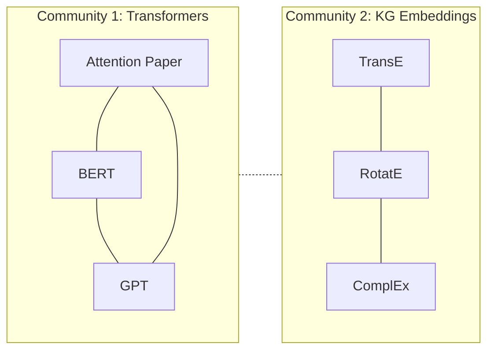

*[Knowledge Graphs: From Concept to Production](../README.md) · Day 9 of 15*

# Day 9 — GraphRAG: Retrieval Over Structure

> **Today's one idea:** GraphRAG retrieves multi-hop structured context that flat vector search cannot — by building a KG from the corpus and using community detection to answer *global* questions that no single chunk addresses.
> **Reading time:** ~40 min · **Prereqs:** [Days 1–8](../README.md)
> **Primary source for today:** Edge, Darren et al. "From Local to Global: A Graph RAG Approach to Query-Focused Summarisation." Microsoft Research, 2024. arXiv:2404.16130. Read §1–3 (7 pages).

---

## The hook (2–4 min)

Your team has ingested 1,000 research papers into a Neo4j KG. An engineer asks: *"What are the three main research themes in this corpus, and which authors are central to each?"*

Plain vector RAG fails here. It retrieves the 5 chunks most similar to the query string — but no single chunk says "theme 1, theme 2, theme 3." The answer requires reading across the *entire corpus* and synthesising connections that span hundreds of papers.

This is the **global question problem**. It was the motivating observation behind Microsoft's GraphRAG (2024): some questions require global reasoning over a corpus that no single retrieved chunk can answer.

GraphRAG's solution: before query time, cluster the KG into communities of tightly connected entities, summarise each community with an LLM, and store those summaries. At query time, for global questions, retrieve *summaries* instead of chunks. For local questions (about specific entities), retrieve the *subgraph* around the matched entities. You now have two retrieval modes, not one.

---

## Building the intuition (10–15 min)

### The two failure modes of vanilla RAG

```
Vanilla RAG retrieves chunks by semantic similarity:

Query: "What are the main themes?"
↓ embed query
↓ ANN search over chunk embeddings
↓ return top-5 most similar chunks

Problem 1 (LOCAL MISS): The answer requires connecting facts
across 3 different chunks that aren't individually similar
to the query.

Problem 2 (GLOBAL MISS): The answer requires summarising
the entire corpus — no single chunk can answer it.
```

GraphRAG fixes both:

```
GraphRAG adds structure on top of the vector index:

OFFLINE (indexing):
  Text → [KG extraction] → Entity graph
       → [Community detection] → Clusters of related entities
       → [LLM summarisation] → Community reports

ONLINE (querying):
  Local query  → find relevant entities → retrieve subgraph + text chunks
  Global query → retrieve community reports → map-reduce summarisation
```

### Community detection: the key insight

A **community** in a graph is a cluster of nodes that are densely connected to each other and sparsely connected to the rest. In a KG of research papers, a community might be "all papers about transformer architectures and their authors."



Once you detect communities, you summarise each one with an LLM: "Community 1 covers transformer architectures, including self-attention, BERT, and GPT models. Key authors: Vaswani, Devlin, Brown." These summaries are then used for global retrieval.

### The two query modes

**Local search** (for specific entity questions):
1. Embed the query
2. Find matching entities in the KG (by name or embedding similarity)
3. Extract the subgraph around those entities (N hops)
4. Feed subgraph + relevant text chunks to the LLM
5. Generate answer

**Global search** (for corpus-wide questions):
1. Score each community report for relevance to the query
2. Map: LLM answers the query from each relevant community report
3. Reduce: LLM combines the partial answers into a final answer

---

## The formal picture (10–15 min)

### Building a simplified GraphRAG from scratch

```python
# pip install anthropic neo4j networkx python-louvain
import json, networkx as nx
import community as community_louvain  # python-louvain
import anthropic
from neo4j import GraphDatabase

client = anthropic.Anthropic()

# ── Step 1: Load the KG into a NetworkX graph ──────────────────────────

def load_kg_from_neo4j(uri, user, password) -> nx.Graph:
    """Pull all edges from Neo4j and build an undirected NetworkX graph."""
    driver = GraphDatabase.driver(uri, auth=(user, password))
    G = nx.Graph()
    with driver.session() as session:
        result = session.run(
            "MATCH (a)-[r]->(b) RETURN a.name AS src, b.name AS tgt, type(r) AS rel"
        )
        for record in result:
            src, tgt = record["src"], record["tgt"]
            if src and tgt:
                G.add_edge(src, tgt, relation=record["rel"])
    driver.close()
    print(f"Loaded graph: {G.number_of_nodes()} nodes, {G.number_of_edges()} edges")
    return G

# ── Step 2: Community detection (Louvain algorithm) ───────────────────

def detect_communities(G: nx.Graph) -> dict[int, list[str]]:
    """Returns {community_id: [node_names]}."""
    partition = community_louvain.best_partition(G)
    communities: dict[int, list[str]] = {}
    for node, cid in partition.items():
        communities.setdefault(cid, []).append(node)
    print(f"Detected {len(communities)} communities")
    return communities

# ── Step 3: Summarise each community ──────────────────────────────────

COMMUNITY_SUMMARY_PROMPT = """You are summarising a cluster of related entities from a knowledge graph.

Entities in this community:
{entities}

Relationships between them:
{relationships}

Write a 2-3 sentence summary of what this community of entities represents. 
Focus on the common theme, key entities, and important relationships.
Be specific and factual."""

def summarise_community(G: nx.Graph, nodes: list[str]) -> str:
    """Ask an LLM to summarise a community."""
    # Collect edges within the community
    node_set = set(nodes)
    edges = [
        f"{u} --{d['relation']}--> {v}"
        for u, v, d in G.edges(data=True)
        if u in node_set and v in node_set
    ]
    if len(nodes) < 2:
        return f"Singleton entity: {nodes[0]}"

    prompt = COMMUNITY_SUMMARY_PROMPT.format(
        entities=", ".join(nodes[:20]),   # cap at 20 to avoid huge prompts
        relationships="\n".join(edges[:30])
    )
    response = client.messages.create(
        model="claude-haiku-4-5-20251001",  # use Haiku for cost efficiency
        max_tokens=256,
        messages=[{"role": "user", "content": prompt}]
    )
    return response.content[0].text.strip()

def build_community_index(G: nx.Graph) -> list[dict]:
    """Build the community report index."""
    communities = detect_communities(G)
    index = []
    for cid, nodes in communities.items():
        if len(nodes) < 2:
            continue  # skip singletons
        summary = summarise_community(G, nodes)
        index.append({
            "community_id": cid,
            "entities": nodes,
            "summary": summary,
        })
        print(f"  Community {cid} ({len(nodes)} nodes): {summary[:60]}...")
    return index

# ── Step 4: Query functions ────────────────────────────────────────────

GLOBAL_QUERY_PROMPT = """Answer the following question using ONLY the community 
summaries provided. If the summaries don't contain relevant information, say so.

Question: {query}

Community summaries:
{summaries}

Provide a concise, structured answer."""

def global_search(query: str, community_index: list[dict]) -> str:
    """Answer a global (corpus-wide) question using community summaries."""
    # Simple relevance filter: keep communities whose summary mentions query keywords
    keywords = set(query.lower().split())
    relevant = [
        c for c in community_index
        if any(kw in c["summary"].lower() for kw in keywords)
    ] or community_index  # fallback: use all if none match

    summaries = "\n\n".join(
        f"[Community {c['community_id']}]\n{c['summary']}"
        for c in relevant[:10]  # top 10
    )
    response = client.messages.create(
        model="claude-sonnet-4-6",
        max_tokens=512,
        messages=[{"role": "user", "content": GLOBAL_QUERY_PROMPT.format(
            query=query, summaries=summaries
        )}]
    )
    return response.content[0].text.strip()

LOCAL_QUERY_PROMPT = """Answer the following question using the subgraph context provided.

Question: {query}

Relevant subgraph (entities and relationships):
{subgraph}

Provide a specific, factual answer based only on the provided context."""

def local_search(query: str, G: nx.Graph, entity_name: str, hops: int = 2) -> str:
    """Answer a local (entity-specific) question using subgraph context."""
    if entity_name not in G:
        return f"Entity '{entity_name}' not found in graph."

    # Collect N-hop neighbourhood
    subgraph_nodes = {entity_name}
    frontier = {entity_name}
    for _ in range(hops):
        next_frontier = set()
        for node in frontier:
            next_frontier.update(G.neighbors(node))
        subgraph_nodes.update(next_frontier)
        frontier = next_frontier

    # Format as readable context
    edges = [
        f"{u} --{d.get('relation', 'related_to')}--> {v}"
        for u, v, d in G.edges(data=True)
        if u in subgraph_nodes and v in subgraph_nodes
    ]
    subgraph_text = f"Central entity: {entity_name}\n\nConnections:\n" + "\n".join(edges[:40])

    response = client.messages.create(
        model="claude-sonnet-4-6",
        max_tokens=512,
        messages=[{"role": "user", "content": LOCAL_QUERY_PROMPT.format(
            query=query, subgraph=subgraph_text
        )}]
    )
    return response.content[0].text.strip()

# ── Putting it together ────────────────────────────────────────────────

class GraphRAG:
    def __init__(self, neo4j_uri, user, password):
        self.G = load_kg_from_neo4j(neo4j_uri, user, password)
        print("Building community index (this calls the LLM once per community)...")
        self.community_index = build_community_index(self.G)
        print(f"Index built: {len(self.community_index)} communities summarised.")

    def query(self, question: str, mode: str = "auto",
              entity_hint: str = None) -> str:
        """
        mode="global"  → use community summaries (best for: themes, overviews)
        mode="local"   → use entity subgraph (best for: specific entities)
        mode="auto"    → use local if entity_hint provided, else global
        """
        if mode == "auto":
            mode = "local" if entity_hint else "global"

        if mode == "global":
            return global_search(question, self.community_index)
        else:
            entity = entity_hint or question.split()[0]  # naive entity extraction
            return local_search(question, self.G, entity)
```

### Using the GraphRAG system

```python
# Assumes Neo4j is running with data loaded from Day 8
rag = GraphRAG("bolt://localhost:7687", "neo4j", "password123")

# Global question: needs corpus-wide synthesis
answer = rag.query(
    "What are the main software frameworks in this knowledge graph?",
    mode="global"
)
print("GLOBAL:", answer)

# Local question: needs entity-specific subgraph
answer = rag.query(
    "What is LangChain connected to?",
    mode="local",
    entity_hint="LangChain"
)
print("LOCAL:", answer)
```

### How this relates to Microsoft's full GraphRAG

The full Microsoft implementation (github.com/microsoft/graphrag) adds:

| Feature | Our simplified version | Microsoft GraphRAG |
|---------|----------------------|-------------------|
| Community detection | Louvain (1 level) | Leiden (hierarchical, multiple levels) |
| Community reports | 2-3 sentences | Structured reports with claims, key entities |
| Global query | Single LLM call over summaries | Map-reduce over community reports |
| Local query | N-hop subgraph | Combines subgraph + text chunks + summaries |
| Entity embedding | None | Embedded for ANN search |
| Storage | Neo4j + in-memory | Parquet files + vector store |

For production use with 10k+ documents, use the Microsoft library. For custom control and smaller corpora, our implementation is enough.

---

## Where it breaks / what it is not (3–5 min)

**GraphRAG is expensive to index.** For 1,000 documents, indexing requires: 1,000 extraction calls + N community summaries. Microsoft's docs report ~$10–50 per million tokens for a mid-size corpus. Always cache both the extraction output and the community index.

**Community detection is non-deterministic.** Louvain and Leiden both use randomness. Re-running on the same graph may produce slightly different community assignments. Set a random seed (`best_partition(G, random_state=42)`) for reproducibility.

**Global search doesn't cite sources.** Community summaries aggregate many entities — the LLM's answer is a synthesis, not a direct quote from a document. If your downstream use case requires citations, you need to track which documents contributed to each community and include that in the retrieval context.

**GraphRAG is not always better than vector RAG.** For simple factual lookups ("What did Alice publish in 2022?"), a direct KG query or a dense vector search is faster and cheaper. Use GraphRAG when the question genuinely requires multi-hop reasoning or corpus-wide synthesis.

---

## Try it yourself (5–10 min)

**Exercise 1 — Build and query (L1/L2):** Load the graph from Day 8 into GraphRAG. Ask one global question and one local question. Do the answers make sense given the documents you ingested?

**Exercise 2 — Inspect communities (L2):** Print the entities in each community after `detect_communities`. Do the groupings make semantic sense? What does the Louvain algorithm get right and wrong?

**Exercise 3 — Stretch (L2):** Add a `hybrid_search` method that:
1. Runs a local subgraph retrieval around the top entity mentioned in the query
2. Finds the community that entity belongs to
3. Returns both the subgraph context AND the community summary
4. Asks the LLM to answer using both sources

<details>
<summary>Key code for Exercise 3</summary>

```python
def hybrid_search(self, query: str, entity_hint: str) -> str:
    # 1. Get subgraph context
    subgraph_context = local_search(query, self.G, entity_hint)

    # 2. Find entity's community
    partition = community_louvain.best_partition(self.G)
    entity_community_id = partition.get(entity_hint)
    community_summary = next(
        (c["summary"] for c in self.community_index
         if c["community_id"] == entity_community_id),
        "No community found."
    )

    # 3. Combine both contexts
    combined = f"ENTITY CONTEXT:\n{subgraph_context}\n\nCOMMUNITY CONTEXT:\n{community_summary}"
    response = client.messages.create(
        model="claude-sonnet-4-6", max_tokens=512,
        messages=[{"role": "user", "content":
                   f"Answer: {query}\n\nContext:\n{combined}"}]
    )
    return response.content[0].text.strip()
```
</details>

---

## Connect it back

[Days 7–8](day-07-entity-relation-extraction.md) built the KG. Today you built a retrieval system on top of it — turning the graph into an answerable corpus. The key shift: you're no longer just *storing* facts in a graph; you're *reasoning over* the graph's structure (communities = themes; subgraphs = local context). Tomorrow you'll take this one step further: giving an AI agent direct read/write access to the KG as its persistent memory, so it can both retrieve from and contribute to the graph across sessions.

**The question you can answer today that you couldn't this morning:** *Why does a question like "What are the main themes in this corpus?" require a fundamentally different retrieval approach than "What did Alice Chen publish?"*

---

## Suggested readings for today

**Required if you have 15 extra minutes:** Edge et al., "From Local to Global: A Graph RAG Approach to Query-Focused Summarisation," arXiv:2404.16130, §1–3 (pp. 1–7). The abstract, introduction, and method section are the essential read. Directly confirms and extends today's concepts with experimental results.

**If you want the deep version:**
- Microsoft GraphRAG GitHub repo: github.com/microsoft/graphrag — README + `graphrag/index/` source directory. The `_pipeline.py` file shows the full indexing workflow you simplified today.
- Microsoft GraphRAG blog post: microsoft.com/en-us/research/blog/graphrag-unlocking-llm-discovery-on-narrative-private-data/ — the best plain-English explanation of why global questions break vector RAG. Read before or after the paper.
- python-louvain documentation: python-louvain.readthedocs.io — covers the Louvain algorithm's parameters. Specifically: the `resolution` parameter controls community granularity (higher = more, smaller communities).

---

← [Day 8 — The Ingestion Pipeline](day-08-ingestion-pipeline.md) &nbsp;|&nbsp; [Day 10 — KGs as Agent Memory →](day-10-kgs-as-agent-memory.md)
