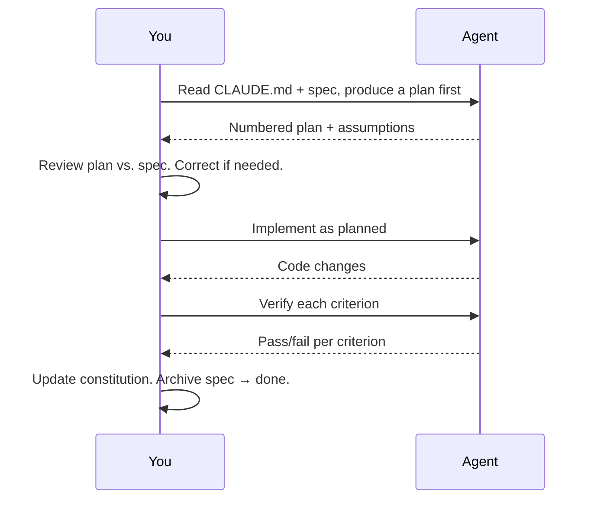

*[Spec-Driven Development](../../README.md) · Day 5 of 7*

# Day 5 — Plan → Implement → Verify

> **Today's one idea:** Running a spec through a coding agent is a three-beat loop — get a plan first, implement second, verify against acceptance criteria third — and the plan beat is where nearly all miscommunication gets caught.
> **Reading time:** ~35 min · **Prereqs:** [Day 4](day-04-writing-feature-specs.md)
> **Primary source for today:** Spec-Driven Development with Coding Agents, Paul Everitt, DeepLearning.AI, Lessons 4–5. learn.deeplearning.ai/courses/spec-driven-development-with-coding-agents

---

## The hook

You have a project constitution in CLAUDE.md. You have a feature spec in `specs/feature-csv-export.md`. You open your coding agent. You type:

> *"Build the CSV export feature."*

The agent starts writing code immediately. Twenty minutes later it shows you 300 lines of changes across 8 files. You start reviewing. At line 45 you notice it added a new API endpoint — which your spec explicitly said not to do. The agent didn't read the no-gos carefully. Or it read them but decided the server-side approach was better. Or it read a different version of the spec.

You spend 40 minutes reviewing and explaining what went wrong. The agent refactors. You review again.

This is the vibe coding trap, even with a good spec. The problem is not the spec — the spec is fine. The problem is you asked the agent to *implement* when you should have asked it to *plan* first.

---

## Building the intuition

Think about how a surgeon handles a complex procedure they haven't done in a while. They don't walk in and start cutting. They review the chart, talk through the procedure with the team, confirm the approach. They *plan* out loud, in steps. If someone on the team says "wait, the patient is allergic to that," they catch it *before* the incision — not during.

The plan step is your pre-surgical review. It costs 2 minutes. It surfaces 80% of the misunderstandings. And because it is in plain language (not code), you can correct it instantly, without a code review.

Here is the core insight:

> **Misunderstandings are cheap at the plan stage. They are expensive at the code stage.**

A wrong plan takes 30 seconds to correct: "No, don't use a server endpoint — the spec says client-side only." A wrong implementation takes 30 minutes to review, understand, and revert.

The plan-implement-verify loop is three beats. Each beat has a specific prompt. The beats are not optional — skipping the plan beat is how good specs produce bad output.

---

## The formal picture

### Beat 1: Plan

**What you do:** Give the agent both the constitution and the spec. Ask it to produce an implementation plan — numbered steps, one per file change — before writing any code.

**The prompt pattern:**

```
Read CLAUDE.md and specs/feature-csv-export-user-list.md carefully.

Before writing any code, produce a step-by-step implementation plan:
- Number each step
- For each step, state: which file you will change, what the change is, 
  and which acceptance criterion it satisfies
- Note any assumptions you are making

Do not write any code yet.
```

**What a good plan looks like:**

```
Implementation plan for: CSV Export — User List

Step 1: Add "Export CSV" button to UserListPage.tsx
  File: src/admin/pages/UserListPage.tsx
  Change: Add an <ExportButton> component in the toolbar area, 
          next to the existing search input.
  Satisfies: AC1 (button present on user list page)

Step 2: Implement CSV generation utility
  File: src/lib/exportCsv.ts (new file)
  Change: Create a function exportUsersToCSV(users: User[]) that 
          generates a CSV string with columns Name, Email, Role, 
          Created Date and triggers a browser download via Blob + 
          URL.createObjectURL.
  Satisfies: AC1 (download triggers), AC2 (correct columns), AC3 (empty case)

Step 3: Wire button to utility
  File: src/admin/pages/UserListPage.tsx
  Change: Connect the ExportButton onClick to exportUsersToCSV(), 
          passing the currently filtered users array (not all users).
  Satisfies: AC1 (filtered export)

Assumptions:
- The User type has fields: name, email, role, createdAt
- createdAt is a Date or ISO string that I'll format as YYYY-MM-DD
- I'll use the existing Tailwind button styling from the search box toolbar
```

**What you do with the plan:**

Read each step against your spec. Ask:
- Does any step violate a no-go? ("server-side export endpoint" → reject immediately)
- Does each acceptance criterion appear in at least one step?
- Are the assumptions reasonable?
- Are there steps that seem unnecessary or out of scope?

If the plan looks wrong, correct it now:

```
Step 2 looks good, but I need to confirm: the export should use 
URL.createObjectURL, not a library. Also, createdAt is always an 
ISO string — no need to handle Date objects.

Please revise Step 2 accordingly, then proceed with implementation.
```

The correction takes 10 seconds. The same correction in code review would take 10 minutes.

---

### Beat 2: Implement

**What you do:** Once the plan is approved (or corrected), ask the agent to implement it.

**The prompt pattern:**

```
The plan looks good. Please implement it exactly as described.

If you encounter anything unexpected — a file that doesn't exist, 
a type that doesn't match, a pattern that differs from what the plan 
assumed — stop and tell me before changing the plan.
```

The "stop and tell me" instruction is the most important part. Without it, the agent makes judgment calls silently. You discover them in code review as unexplained deviations.

With it, the agent surfaces surprises explicitly. You make the call. The implementation stays close to the approved plan.

**What to do while the agent implements:**

Nothing. Let it work. Don't add new requirements mid-implementation. Don't ask it to "also add X while you're in there." Scope changes mid-implementation produce code that doesn't fully match any spec. If you think of something new, add it to the next feature spec.

---

### Beat 3: Verify

**What you do:** After the agent finishes, check each acceptance criterion explicitly. Do not assume the implementation is correct because it runs.

**The prompt pattern:**

```
Implementation is complete. Now go through each acceptance criterion 
in specs/feature-csv-export-user-list.md one by one.

For each criterion:
1. State whether the current implementation satisfies it
2. Describe how you verified it (ran a test, traced the code, etc.)
3. If it does not satisfy the criterion, state why and what would fix it
```

**What a good verification response looks like:**

```
AC1: "Clicking 'Export CSV' downloads a CSV of currently visible users."
✓ Satisfied. UserListPage.tsx lines 89-91 pass filteredUsers (the 
  state variable filtered by the search input) to exportUsersToCSV(). 
  The button click triggers the download. Verified by code trace.

AC2: "CSV has columns: Name, Email, Role, Created Date (in that order)."
✓ Satisfied. exportCsv.ts line 12 defines the header row as 
  ['Name', 'Email', 'Role', 'Created Date']. Verified by reading 
  the source.

AC3: "With 0 visible users, the CSV downloads with headers only."
✓ Satisfied. exportUsersToCSV([]) produces a string with the header 
  row followed by a newline and no data rows. Verified by tracing 
  the function with an empty array input.
```

**If a criterion fails:**

Do NOT ask the agent to "fix it" with a vague follow-up. That's vibe coding. Instead:

1. Identify the gap precisely: which criterion failed and why?
2. Amend the spec (or write a tiny new spec) for the gap
3. Run the loop again: plan → implement → verify for the gap only

The loop is a unit. Each run of the loop should be scoped to one spec. Bug fixes are new specs.

---

### The replanning step

After the feature ships, update the project constitution's roadmap:

```markdown
## Current roadmap

Completed:
- [x] User authentication
- [x] Kanban board
- [x] Search on user list
- [x] CSV export — user list   ← add this

In progress:
- [ ] Email notifications on task assignment (see specs/...)
```

This keeps the agent oriented for the next feature. The constitution is the single source of truth for project state.

---

### The full loop at a glance



---

## Where it breaks / what it is not

**"The agent produced a plan but it's already wrong — what does that mean?"**
It means your spec had ambiguity the agent resolved incorrectly. Read the plan against your spec: which word or missing constraint led the agent to that interpretation? Fix the spec, then re-run Beat 1. The plan surfaced the ambiguity cheaply.

**"The agent keeps stopping mid-implementation to ask questions."**
Good — that means it found an unexpected situation and followed your "stop and tell me" instruction. Answer the question, confirm the approach, let it continue. These stops are spec gaps surfaced at the cheapest possible moment.

**"Can I just skip the plan step for small changes?"**
For true one-liners (fix a typo, rename a variable), yes. For anything with at least one acceptance criterion — no. The plan step takes 90 seconds. The debugging it prevents takes 30 minutes.

**"What if the agent's verification says ✓ but I can see the code is wrong?"**
Trust your eyes over the agent's self-assessment. The agent verifies by code trace, which is imperfect. For anything with business logic, open the app and test manually. The agent's verification is a first-pass check, not a substitute for human judgment.

---

## Try it yourself

### Exercise 1 — Plan prompt practice
Take the spec you wrote yesterday (Day 4 Exercise 3). Write the exact prompt you would use for Beat 1 — the plan step. Include: the file paths you'd reference, the instruction to number each step, and the "stop and tell me" instruction.

### Exercise 2 — Read a plan critically
Here is a (simplified) implementation plan for the CSV export spec. Find the problem:

```
Step 1: Add Export button to UserListPage.tsx
Step 2: Create a new API endpoint GET /api/admin/users/export that 
        returns user data as CSV
Step 3: Wire the button to call the new endpoint and trigger a download
```

What's wrong? Which spec element did the agent not follow?

### Exercise 3 — Write a verify prompt
After the implementation is complete, write the exact prompt you'd use for Beat 3 — the verify step. Include the file path to the spec.

<details>
<summary>Answer for Exercise 2</summary>

Step 2 creates a server-side API endpoint — which is explicitly in the no-gos: "No server-side export endpoint." The agent either didn't read the no-gos section or interpreted "no server-side export" differently.

The correct plan would be: create a client-side CSV generation utility (a new TypeScript file in src/lib/) that generates the CSV from the already-fetched filteredUsers array in memory, using the browser's Blob API to trigger a download.

You would catch this in Beat 1 (before any code is written) and correct it: "Step 2 is wrong — the spec says no server-side endpoint. The export must be client-side, using the already-fetched user data. Revise Step 2 and proceed."

Total time to catch and fix: 20 seconds. Time to catch this in code review: 20 minutes.
</details>

---

## Connect it back

Days 1–4 were about building artifacts: the mental model (Day 1), the four-layer anatomy (Day 2), the project constitution (Day 3), and the feature spec (Day 4). Today you learned what to *do* with those artifacts: a three-beat loop where the plan step is the critical gate.

The question you should now be able to answer: *At what stage in the plan-implement-verify loop do you catch the most miscommunications, and why?*

The answer: Beat 1 (Plan). Because natural language is easier to read and correct than code. A wrong plan costs 30 seconds to fix. A wrong implementation costs 30 minutes.

**Tomorrow (Day 6)** you wire this entire workflow into a pipeline: project folder structure, CI configuration, and the deployment step. The loop you learned today becomes a reproducible, automated system.

---

## Suggested readings for today

**Required if you have 15 extra minutes:**
Paul Everitt, "Spec-Driven Development with Coding Agents," Lessons 4 and 5 (plan and implement phases), DeepLearning.AI. learn.deeplearning.ai/courses/spec-driven-development-with-coding-agents. Everitt runs through the loop live, including a moment where the plan reveals a misunderstanding and he corrects it before any code is written. That moment is the whole lesson.

**If you want the deep version:**

- Paul Everitt, Lesson 6 ("Replanning") in the same course. The replanning step — updating the constitution roadmap after a feature ships — is short but often skipped. Everitt shows why a stale roadmap causes problems on the next feature.

- Anthropic, "Prompt Engineering Guide," docs.anthropic.com/en/docs/build-with-claude/prompt-engineering/overview. The "chain of thought" section explains why asking the agent to produce a plan before implementing improves output quality. The mechanism is: step-by-step reasoning before action produces more accurate results than jumping directly to the answer.

---

← [Day 4 — Writing Feature Specs](day-04-writing-feature-specs) &nbsp;|&nbsp; [Day 6 — The Full Pipeline →](day-06-full-pipeline)
