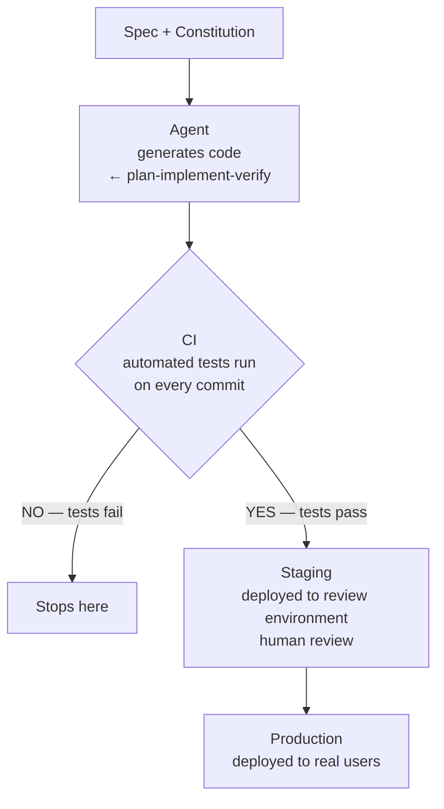
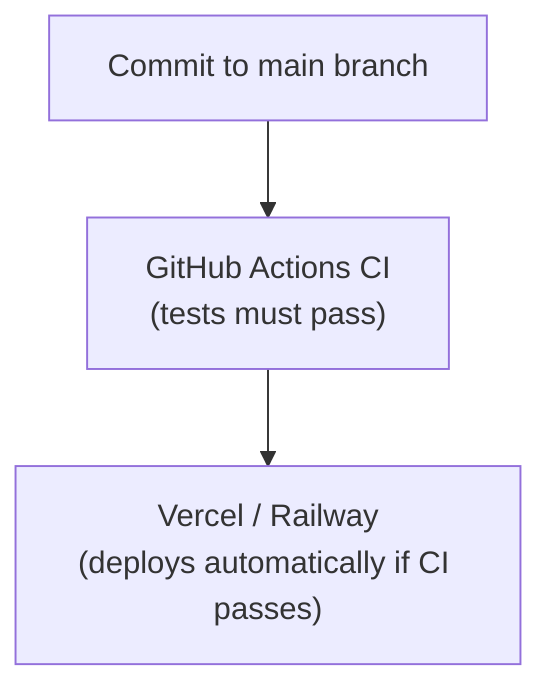
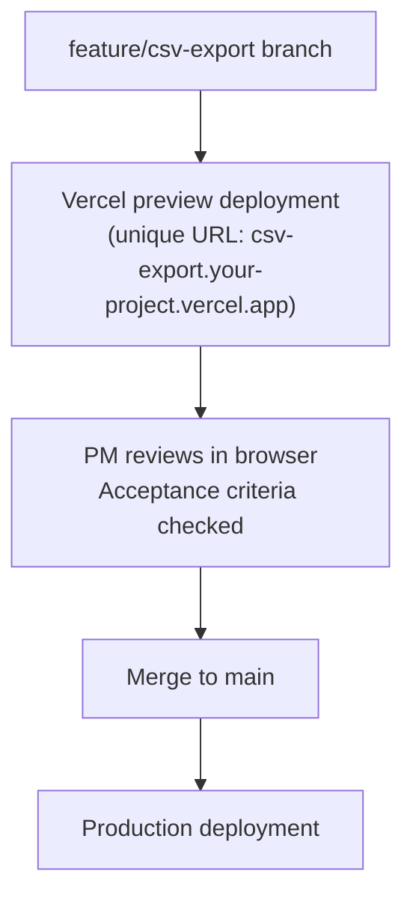

*[Spec-Driven Development](../../README.md) · Day 6 of 7*

# Day 6 — The Full Pipeline

> **Today's one idea:** Spec → agent → CI → deploy is a single reproducible template you set up once per project; the spec is the durable asset, and the agent is the interchangeable executor.
> **Reading time:** ~40 min · **Prereqs:** [Days 1–5](../README.md)
> **Primary source for today:** Humble & Farley, *Continuous Delivery*, Addison-Wesley, 2010 — Chapter 5 ("The Commit Stage"). ISBN 978-0321601919.

---

## The hook

Before today's reading, spend 5 minutes doing this:

1. Open your Day 3 project constitution. Read the mission and tech stack sections.
2. Open the feature spec you wrote in Day 4. Re-read the acceptance criteria.
3. Ask: if I handed both of these documents to a colleague who had never seen this project, could they run the plan-implement-verify loop from Day 5 and ship the feature?

If the answer is yes, you are 80% of the way to a full pipeline. Today you build the remaining 20%: the automated chain that takes the agent's output from your local machine to a deployed environment without you manually doing anything after the verify step.

---

## Building the intuition

Think about a well-run factory assembly line. Raw materials go in one end. Finished products come out the other. Every step is defined, repeatable, and automated. If a part fails inspection at step 3, it doesn't reach step 4. No human has to stand at step 4 to catch defective parts — the line stops automatically.

Your spec-to-deploy pipeline is the same thing. The "raw material" is a feature spec. The "finished product" is a deployed feature. The "inspection steps" are your automated tests. A failing test stops the pipeline — the feature does not ship until it passes.

The pipeline has four stations:



The agent handles the first station. You handle the transition from agent to CI (commit the code). Everything after that is automated.

---

## The formal picture

### The folder structure

Here is the complete project structure for a spec-driven workflow:

```
project-root/
├── CLAUDE.md                    ← project constitution (Day 3)
├── specs/
│   ├── done/
│   │   └── feature-search.md   ← archived specs
│   └── feature-csv-export.md   ← current active spec (Day 4)
├── .github/
│   └── workflows/
│       └── ci.yml               ← CI pipeline config
├── src/
│   └── ...                      ← agent-generated code
├── tests/
│   └── ...                      ← tests (agent writes these too)
└── package.json
```

The key insight: **specs live in the repo**. Not in Notion. Not in Confluence. In the same version-controlled repository as the code. This means:
- The agent can reference them by file path
- Git history shows exactly when a spec was written and how it evolved
- A colleague can open a PR and see the spec alongside the code changes

---

### The CI pipeline

CI (Continuous Integration) is an automated system that runs your tests every time code is committed. If tests pass, the code moves forward. If tests fail, it stops.

Here is a minimal GitHub Actions CI configuration that works for most web projects:

```yaml
# .github/workflows/ci.yml
name: CI

on:
  push:
    branches: [main, feature/*]
  pull_request:
    branches: [main]

jobs:
  test:
    runs-on: ubuntu-latest
    
    steps:
      - name: Checkout code
        uses: actions/checkout@v4

      - name: Set up Node.js
        uses: actions/setup-node@v4
        with:
          node-version: '20'
          cache: 'npm'

      - name: Install dependencies
        run: npm ci

      - name: Run tests
        run: npm test

      - name: Build
        run: npm run build
```

**What this does:** Every time code is pushed or a pull request is opened, GitHub runs your tests and build automatically. If either fails, the PR cannot be merged until it's fixed.

**The agent writes the tests too.** When you run the plan-implement-verify loop, include test writing in the spec or as a constraint:

```markdown
## Constraints
- Write unit tests for any new utility functions (co-located as *.test.ts)
- Tests must pass with `npm test` before implementation is complete
```

The agent will write the tests as part of the implementation. The CI pipeline then runs those tests on every commit.

---

### The deploy step

Deployment is platform-specific. Here are the three most common setups for a PM building with a coding agent, ordered by simplicity:

---

**Option A: Vercel (frontend) + Railway (backend) — recommended for most projects**

These platforms auto-deploy on every push to `main`. No configuration needed beyond connecting your GitHub repo.



Add to CLAUDE.md so the agent knows the hosting:
```markdown
## Hosting
- Frontend: Vercel (auto-deploys from main branch)
- Backend: Railway (auto-deploys from main branch)
- Staging: feature branches deploy to preview URLs on Vercel
```

---

**Option B: GitHub Actions → deploy**

For more control, add a deploy step to your CI:

```yaml
# Add to .github/workflows/ci.yml after the test job
  deploy:
    needs: test          # only runs if test job passes
    runs-on: ubuntu-latest
    if: github.ref == 'refs/heads/main'
    
    steps:
      - uses: actions/checkout@v4
      
      - name: Deploy to production
        run: npx vercel --prod --token=${{ secrets.VERCEL_TOKEN }}
```

**Option C: Preview deployments for each feature branch**

Each feature branch gets its own preview URL. This is the correct setup for a PM who wants to review features before they merge to main.



Add to CLAUDE.md:
```markdown
## Branching convention
- Feature branches: feature/<spec-name> (e.g., feature/csv-export)
- Each feature branch gets a Vercel preview URL
- Merge to main only after acceptance criteria verified on preview
```

---

### The agent's role in the pipeline

The agent does not push to CI or deploy. You do. The boundary is clear:

```
Agent's responsibility:        Your responsibility:
──────────────────────         ──────────────────────
Write code                     Commit and push code
Write tests                    Review plan (Beat 1)
Verify against criteria        Verify against criteria (Beat 3)
                               Merge to main
                               Monitor deploy
```

The plan-implement-verify loop (Day 5) ends when you have verified all acceptance criteria. At that point you commit the code, open a PR, and CI takes over.

---

### Agent replaceability

This is the payoff of building the pipeline around specs rather than around a specific agent.

Your pipeline has three durable artifacts:
1. `CLAUDE.md` — the project constitution
2. `specs/` — the feature specs
3. `.github/workflows/ci.yml` — the CI config

These files work with any coding agent. If Claude Code is unavailable tomorrow, you open Cursor, point it at `CLAUDE.md` and `specs/feature-csv-export.md`, and run the same plan-implement-verify loop. The agent changes; the workflow does not.

```
Durable artifacts (yours):       Interchangeable (tool):
─────────────────────────        ─────────────────────
CLAUDE.md                   →    Claude Code
specs/*.md                  →    Cursor
.github/workflows/ci.yml    →    GitHub Copilot Workspace
                                 Devin
                                 Any future agent
```

Paul Everitt (DeepLearning.AI course) calls this "agent replaceability" — designing your workflow so the spec is the program, not the agent.

---

### Legacy codebases

If you are adding spec-driven development to an existing project (not a greenfield project), the setup is the same with two additions to CLAUDE.md:

```markdown
## Legacy context

### Known inconsistencies
The following areas of the codebase do NOT follow our conventions 
and should NOT be used as patterns to follow:
- src/legacy/ — old jQuery code, do not reference
- src/api/v1/ — deprecated endpoints, do not call or modify

### Areas to avoid
Do not refactor code outside the scope of the current feature spec. 
If you encounter code that needs refactoring, note it in a comment 
but do not change it.
```

The "do not refactor outside scope" rule is the most important line for legacy work. Without it, the agent will helpfully clean up code adjacent to your feature — which is well-intentioned and destabilizing. Scope discipline is harder in legacy codebases; the constitution enforces it.

---

### The complete workflow, end to end

```
1. Write / update CLAUDE.md (constitution)        [once per project]
2. Write specs/<feature>.md                       [once per feature]
3. Run Beat 1: "Read CLAUDE.md and specs/<feature>.md.
               Produce a numbered implementation plan."
4. Review plan vs. spec. Correct if needed.
5. Run Beat 2: "Implement the plan exactly.
               Stop and tell me if anything is unexpected."
6. Run Beat 3: "Verify each acceptance criterion."
7. Commit and push to feature branch
8. CI runs automatically (tests + build)
9. Review on preview URL (Vercel/Railway)
10. Merge to main → production deploy
11. Update CLAUDE.md roadmap (mark feature done)
12. Archive specs/<feature>.md → specs/done/
```

Steps 1–6 are Days 3–5 of this course. Steps 7–12 are today. The full cycle for a "Small" appetite feature: 2–3 hours including agent time.

---

## Where it breaks / what it is not

**"My project doesn't use GitHub Actions."**
Substitute your CI tool: GitLab CI, CircleCI, Bitbucket Pipelines. The concept is identical — a YAML file that runs tests on every commit. The syntax differs but the structure does not.

**"I don't have tests."**
Then start now. Add to every feature spec's constraints: "Write unit tests for any new utility function." The agent will write them. After 3–4 features you will have meaningful test coverage, built incrementally by the agent as a side effect of spec-driven development.

**"The CI is failing but the feature works — can I skip CI?"**
No. A failing CI is a broken pipeline. Fix the test or fix the code — whichever is wrong. "Works on my machine" is not the same as "ships reliably." The CI gate is what makes the pipeline trustworthy.

**"What about database migrations, environment variables, secrets?"**
These are real concerns outside the scope of a 7-day course. The short answer: add them to CLAUDE.md as known constraints ("database migrations must be backwards-compatible," "new environment variables must be documented in .env.example"). The agent will respect them. For secrets: use your platform's secrets management (GitHub Secrets, Railway Variables, Vercel Environment Variables) — never commit them.

---

## Try it yourself

### Exercise 1 — Set up the folder structure
For your project (or the practice project from Day 4), create:
- `CLAUDE.md` using the Day 3 template
- `specs/` directory with your Day 4 spec in it
- `.github/workflows/ci.yml` using the template above (adjust the test/build commands for your stack)

### Exercise 2 — Add deployment to CLAUDE.md
Add a "Hosting" section to your constitution. State: where the frontend deploys, where the backend deploys, and what the branching convention is (feature branches → preview, main → production).

### Exercise 3 — The replaceability test
Read your CLAUDE.md and your current feature spec. Ask: if I opened a different coding agent right now and gave it only these two files, could it run the plan-implement-verify loop without asking me any clarifying questions? If not, what's missing?

<details>
<summary>Common gaps found in Exercise 3</summary>

The most common things missing from a constitution that prevent agent replaceability:

1. **No test command specified.** The agent doesn't know how to run tests. Add: `Test command: npm test` (or equivalent).
2. **No example of an existing similar feature.** The agent doesn't know the pattern to follow. Add one file path per pattern ("search pattern: see src/admin/pages/ProductListPage.tsx").
3. **No "not in scope" list in tech stack.** The agent picks a framework from its priors. Add explicit exclusions.
4. **Roadmap section is missing or empty.** The agent doesn't know what's coming next and may build things that conflict with upcoming features.
</details>

---

## Connect it back

Days 1–5 gave you the ingredients: the mental model, the four-layer anatomy, the project constitution, the feature spec template, and the plan-implement-verify loop. Today you connected them into a single repeatable system that runs from spec to deployed code without manual steps between CI and production.

The question you should now be able to answer: *What makes this pipeline "agent-replaceable," and why does that matter?*

The durable artifacts are the spec and the constitution — plain Markdown files that any agent can read. The agent is the executor, not the author of the workflow. If the agent changes, the workflow does not.

**Tomorrow (Day 7)** is the capstone. You will do the entire workflow for real — for a feature you actually want to ship — from blank CLAUDE.md to deployed code.

---

## Suggested readings for today

**Required if you have 15 extra minutes:**
Humble & Farley, *Continuous Delivery*, Chapter 5 ("The Commit Stage"), Addison-Wesley, 2010. Focus on the "Why Do We Need a Commit Stage?" section and the "Commit Stage Practices" list. The specific tools have changed since 2010 (GitHub Actions didn't exist then) but the principles — every commit tested, fast feedback, fail fast — are exactly what today's CI template implements.

**If you want the deep version:**

- Paul Everitt, "Spec-Driven Development with Coding Agents," Lesson 8 ("Legacy Codebases"), DeepLearning.AI. learn.deeplearning.ai/courses/spec-driven-development-with-coding-agents. The lesson on applying this methodology to a codebase you didn't write from scratch. The "known inconsistencies" and "areas to avoid" patterns above come directly from this lesson.

- Paul Everitt, Lesson 9 ("Agent Skills"), same course. Packaging your plan-implement-verify prompts as reusable "agent skills" so you don't retype them for every feature. Relevant once you've run the loop 3–4 times and want to automate the prompt itself.

- Anthropic, "Claude Code Documentation — memory and CLAUDE.md," docs.anthropic.com/claude-code. The sections on project memory and how Claude Code loads CLAUDE.md. Understanding *how* the constitution is consumed by the agent helps you write a better one.

---

← [Day 5 — Plan → Implement → Verify](day-05-plan-implement-verify) &nbsp;|&nbsp; [Day 7 — Capstone →](day-07-capstone)
